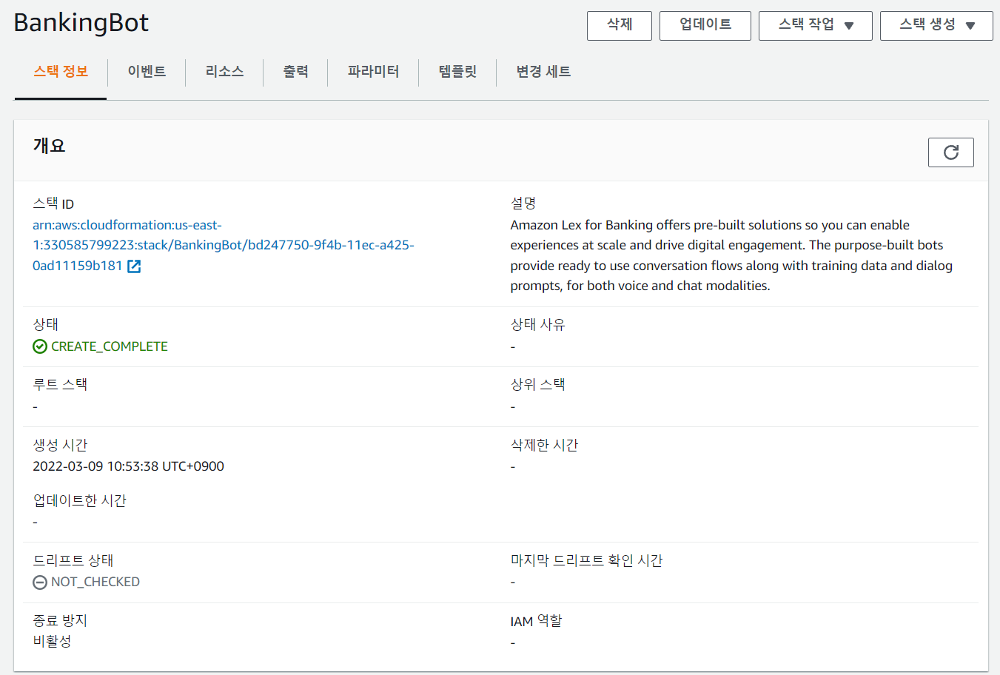
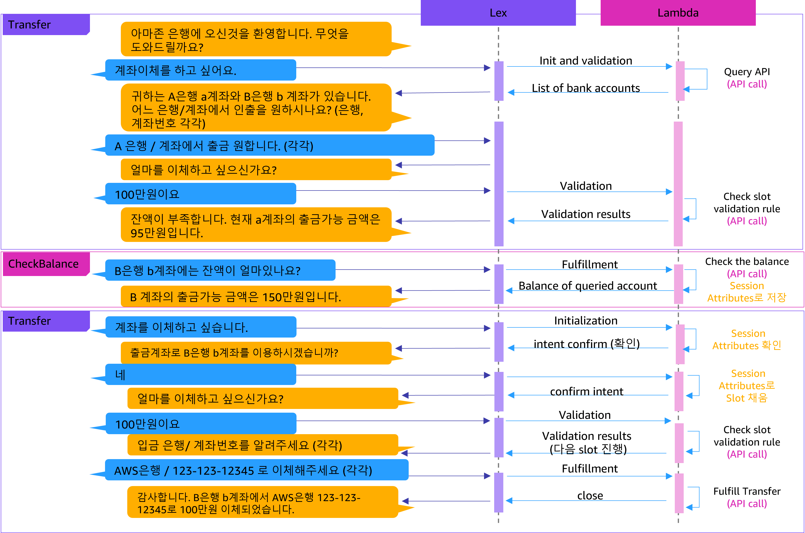
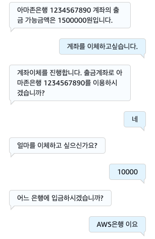
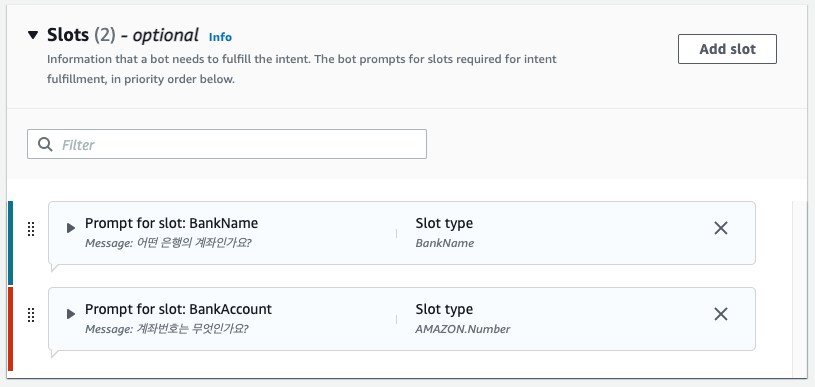
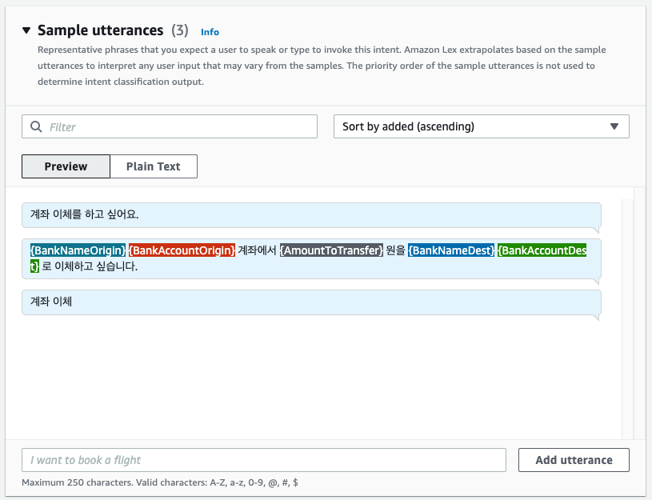
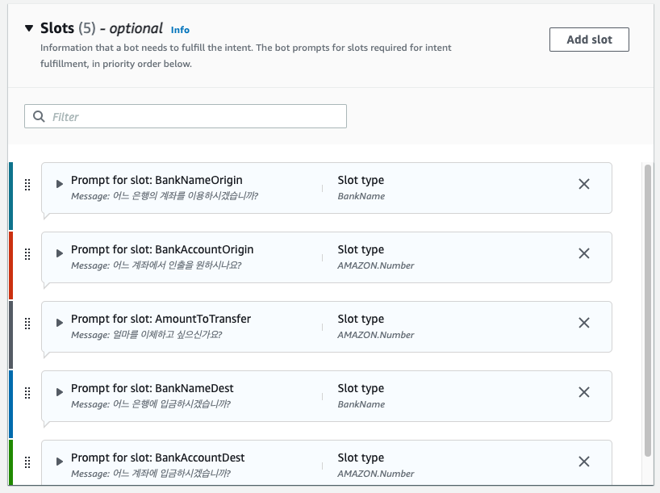
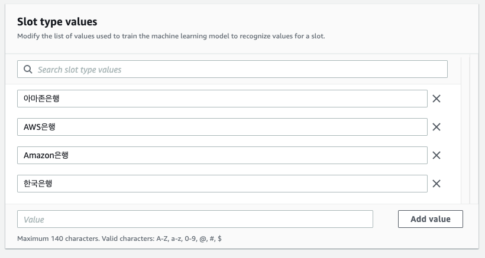
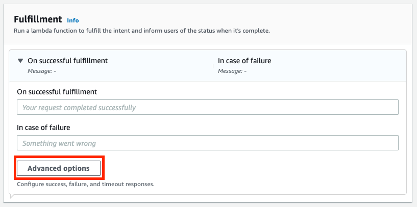

# 뱅킹 봇 구축 워크숍

## 개요

앞서서는 Amazon Lex 콘솔만을 사용하여 간단한 [HelloWorldBot](HelloWorldBot.md)을 만들어 보았습니다. 이번에는 AWS Lambda를 이용해 인터넷 뱅킹을 수행하는 좀 더 복잡한 작업을 하는 봇을 구현해 보겠습니다. 이번 섹션에서는 AWS CloudFormation을 사용하여 봇의 생성 및 구성을 자동화 하는 방법도 함께 살펴 보겠습니다.

## 워크숍 리소스 생성

1. 관리자 권한을 지닌 IAM유저로 매니지먼트 콘솔에 [로그인](https://console.aws.amazon.com/) 합니다.

2. 아래 버튼을 눌러 CloudFormation 스택을 생성합니다.

[](https://console.aws.amazon.com/cloudformation/home#/stacks/new?region=us-east-1&stackName=BankingBot&templateURL=https://ee-assets-prod-us-east-1.s3.us-east-1.amazonaws.com/modules/c16b965656fb4eba8676d6f0ac759300/v1/Lex-KR_BankingBot/CF-YAML-File/CF_KRBankingBot.yaml)

> 주의!</span> 이 워크숍은 현재 버지니아 북부(us-east-1) 리전에서만 동작합니다. 위 링크를 클릭하면 자동으로 버지니아 북부 리전이 선택됩니다.

3. 스택 생성 화면에서 **다음**을 클릭합니다.

4. 스택 세부 정보 지정 화면에서 **다음**을 클릭니다.

5. 스택 옵션 구성 화면에서 **다음**을 클릭합니다.

6. BankingBot 검토 화면에서 맨 아래로 이동한 다음 **AWS CloudFormation에서 IAM 리소스를 생성할 수 있음을 승인합니다.** 앞의 체크 박스를 체크한 다음 **스택 생성**을 클릭합니다.

7. **스택 정보** 탭을 클릭한 후에 상태가 **CREATE_IN_PROGRESS**에서 **CREATE_COMPLETE**로 변경되는것을 기다립니다.



## Banking Bot 구조 살펴보기

이제 Banking Bot을 시작하기 위한 리소스들이 모두 준비되었습니다.

Banking Bot은 잔고 확인(CheckBalance)과 송금(Transfer) 두 개의 의도(Intent)와 각각의 의도의 내용을 처리하기 위한 두 개의 람다 함수, 그리고 상태값을 저장하기 위한 DynamoDB 테이블로 구성되어 있습니다.

전체적인 처리의 흐름은 아래 다이어그램을 참고해 주세요.



### 대화 예제

Banking Bot의 전체 대화 흐름 예제 입니다.





### 의도: CheckBalance

### 대화 흐름

앞에서도 언급했듯이 한 개의 챗봇은 여러개의 의도(Intents)를 가질 수 있습니다. 이 Banking Bot은 잔고확인을 위한 CheckBalance와 송금을 위한 Transfer 두 개의 의도를 가지고 있습니다.

### 의도 : CheckBalance

- 대화 흐름


- 슬롯: CheckBalance에서는 다음 두 개의 값을 슬롯으로 입력받습니다.



### 의도 : Transfer

- 대화 흐름



- 슬롯
  - Transfer에서는 다음 다섯개의 값을 슬롯으로 입력받습니다.



### Slot Type : BankName

은행명을 입력받기위한 슬롯 타입입니다. 여러 슬롯에서 공통으로 사용됩니다.



# 참고사항

## Alias와 Version Mapping

- Alias는 버전과 연결되고, 버전내 각각의 언어 별로 Lambda를 Mapping 할수 있습니다.

- 하나의 언어의 의도가 validation/initialization과 Fulfillment에 사용되는 Lambda를 하나로 공유하며,

  Version 1가 다르게 의도 별로 Lambda를 매핑하지 않습니다.


## 의도 내에서 Lambda 호출 시점 설정

의도 내에서 Lambda가 호출되는 시점은

- Initialization (의도가 파악되고 첫번째 슬롯을 위한 질문하기 전)와 Validation(각 슬롯에 대한 응답이 왔을때)
- Fulfillment : 모든슬롯이 채워졌을때

이며, 아래와 같이 각 의도에서 Checkbox를 활성화 해야지만 트리거 됩니다.

- Initialization와 Validation


- Fulfillment




# Lambda 구조 설명

- Function Name : BankingServiceFunction

- Language : Node.js 14.x

## 코드 설명

- **Index.js :** Lambda의 진입점(index.handler)으로, Lex에서 해석된 Intent 정보에 따라 각각 아래의 파일로 분기합니다.

  - CheckBalance : check_balance.js
  - Transfer : transfer.js
  - FallbackIntent (Built-in Intent) : fallback.js

- **banking_service.js :** DynamoDB에 저장된 계정 정보를 바탕으로 하는 간단한 은행 서비스 API 예제입니다.

  - 기존에 존재하는 Application의 API 연결을 보여주는 예시입니다.

  - DynamoDB는 다음과 같이 구성되어있습니다

    - Table : BankingBot

    

- **utils.js :** Lex로 부터 전달받는 이벤트 데이터를 편리하게 사용하기 위해 만든 Utility입니다.

  주요 함수는 다음과 같습니다.

  - Dialog.elicit_slot : 특정 슬롯을 채우기 위한 질문을 합니다. 주로 슬롯에 유효하지 않아 다시 명시적으로 채우도록 할때 사용합니다. 이때 Lex에서 설정한 각 슬롯의 Prompt가 아니라 동적으로 생성이 가능합니다.

  - Dialog.delegate : Lex에서 정의한 원래 다음 행동을 합니다. 검증이 성공했거나 검증하고자 하는 항목이 아닐때 주로 호출합니다.

  - Dialog.get_slot, Dialog.set_slot : Lex에서 채운 슬롯을 검증하고, 필요한 경우 수정하기 위해 사용됩니다.

## 세션 전환 구현

이 예제에서는 계좌 조회 후 이체를 진행하면 직전에 조회한 계좌번호를 이체에 사용할지 여부를 확인하고 활용하도록 구현되어있습니다.

session_attributes를 활용하여, 이전 의도의 결과를 전달하고, 이를 다른 의도에서 활용할 수 있습니다.

- **CheckBalance** 의도의 Fulfillment 시점에 Session Attribute로 저장

```js
  ...
  else if (intent['state'] == 'ReadyForFulfillment')
  {
    var balance = await BankingService.check_balance (userId, bankName,  bankAccount );
    var messages = balance?[{'contentType': 'PlainText', 'content': `${bankName} ${bankAccount} 계좌의 출금 가능금액은 ${balance}원입니다.`}]:[{'contentType': 'PlainText', 'content': `계좌가 존재하지 않습니다.`}]
    var session_attributes={bankName,bankAccount};

    return Dialog.close(
      active_contexts, session_attributes, intent, messages
    );
  }
```

- Transfer 초기화 시점에 이 정보를 확인하여 슬롯을 미리 채움

```js
const savedBankName = Dialog.get_session_attribute(intent_request, 'bankName');
const savedBankAccount = Dialog.get_session_attribute(intent_request, 'bankAccount');
...
if (savedBankName && savedBankAccount)
{
    prompt = `계좌이체를 진행합니다. 출금계좌로 ${savedBankName} ${savedBankAccount}를 이용하시겠습니까?`;
    console.log(prompt);
    session_attributes.bankName =null;
    session_attributes.bankAccount =null;
    Dialog.set_slot('BankNameOrigin',savedBankName, intent);
    Dialog.set_slot('BankAccountOrigin',savedBankAccount, intent);

    return Dialog.confirm_intent(
                active_contexts, session_attributes, intent,
                [{'contentType': 'SSML','content': prompt}],null );

}
```

## 봇 테스트

- 이제 **테스트** 버튼을 눌러 봇의 테스트를 진행해 봅시다.

축하합니다! 이것으로 여러분은 뱅킹 봇 을 성공적으로 만들었습니다.
