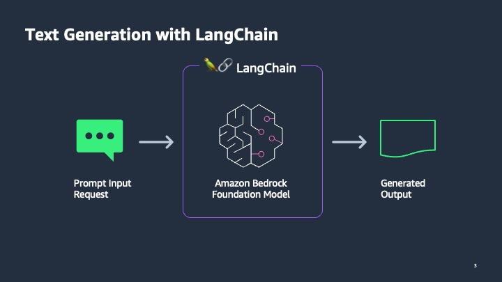

# Lab 1 - Text Generation

## Overview

이 실습에서는 Amazon Bedrock에서 LLM을 사용하여 텍스트를 생성하는 방법을 배웁니다. 베드락 API를 사용해 LLM을 사용하는 방법과 베드락과 통합되는 LangChain 프레임워크를 활용하는 방법을 시연해 보겠습니다. 

먼저 제로 샷 프롬프트를 사용하여 텍스트를 생성합니다. 제로 샷 프롬프트는 자세한 컨텍스트를 제공하지 않고 텍스트 콘텐츠를 생성하는 지침을 제공합니다. 두 가지 접근 방식을 사용하여 제로샷 이메일 생성을 살펴보겠습니다: 베드락 API(BoTo3)와 LangChain과의 베드락 통합. 그런 다음 프롬프트에 추가 컨텍스트를 제공하여 생성된 텍스트의 품질을 개선하는 방법을 보여드리겠습니다.

## Audience

아마존 베드락 LLM을 사용하여 텍스트를 생성하는 방법을 배우려는 아키텍트 및 개발자를 대상으로 합니다. 
텍스트 생성을 위한 몇 가지 비즈니스 사용 사례는 다음과 같습니다:

- 마케팅 팀을 위한 제품 기능 및 이점에 기반한 제품 설명 생성
- 미디어 기사 및 마케팅 캠페인 생성
- 이메일 및 보고서 생성

## Workshop Notebooks

고객이 고객 지원 엔지니어로부터 받은 서비스에 대해 부정적인 피드백을 제공한 고객에 대한 이메일 응답을 생성합니다. 텍스트 생성 워크샵에는 다음 세 가지 노트북이 포함됩니다. 
1. [Amazon Titan으로 이메일 생성](./00_generate_w_bedrock_kr.ipynb) - Bedrock API를 사용하여 Amazon Titan 대용량 텍스트 모델을 호출하여 고객에게 이메일 응답을 생성합니다. 컨텍스트가 없는 제로 샷 프롬프트를 모델에 대한 명령으로 사용합니다. 
2. [Anthropic Claude를 사용한 제로샷 텍스트 생성](01_zero_shot_generation_kr.ipynb) - 고객에게 이메일을 생성하기 위해 Bedrock과 통합된 LangChain 프레임워크를 사용하여 Anthropic의 Claude 텍스트 모델을 호출합니다. 컨텍스트가 없는 제로샷 프롬프트를 모델에 대한 명령으로 사용합니다. 
3. [LangChain을 사용한 문맥 텍스트 생성](./02_contextual_generation_kr.ipynb) - 모델이 응답을 생성할 고객의 원본 이메일을 포함하는 추가 문맥을 프롬프트에 제공합니다. 이 예제에는 런타임에 프롬프트에서 변수 값을 대체할 수 있도록 LangChain에 사용자 지정 프롬프트 템플릿이 포함되어 있습니다.

## Architecture

