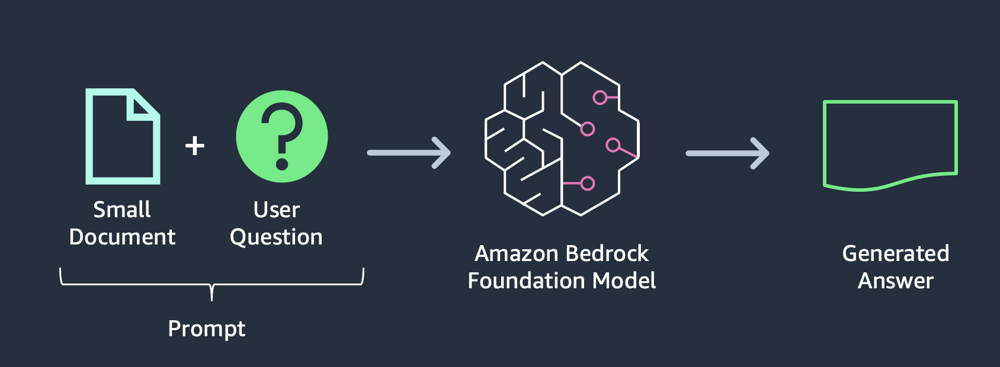

# Lab 3 - Question Answering

## Introduction

QA(질문 답변)는 자연어로 제기된 사실적인 쿼리에 대한 답변을 추출하는 중요한 작업입니다. 일반적으로 QA 시스템은 정형 또는 비정형 데이터가 포함된 지식창고에 대한 쿼리를 처리하고 정확한 정보가 포함된 답변을 생성합니다. 특히 엔터프라이즈 사용 사례에서 유용하고 신뢰할 수 있으며 신뢰할 수 있는 질문 답변 시스템을 개발하려면 높은 정확도를 보장하는 것이 핵심입니다.

Amazon Titan, Anthropic Claude, AI21 Jurassic 2와 같은 제너레이티브 AI 모델은 확률 분포를 사용하여 질문에 대한 답변을 생성합니다. 이러한 모델은 방대한 양의 텍스트 데이터를 학습하여 시퀀스에서 다음에 무엇이 나올지 또는 특정 단어 다음에 어떤 단어가 나올지 예측할 수 있습니다. 그러나 데이터에는 항상 어느 정도의 불확실성이 존재하기 때문에 이러한 모델은 모든 질문에 대해 정확하거나 결정적인 답변을 제공할 수는 없습니다.

기업은 도메인별 및 독점 데이터를 쿼리하고 해당 정보를 사용하여 질문에 답해야 하며, 더 일반적으로는 모델이 학습되지 않은 데이터도 사용해야 합니다.

## Patterns

이 실습에서는 두 가지 QA 패턴을 살펴봅니다:

1. 먼저 질문이 모델에 전송되면 수정 없이 기본 모델을 기반으로 답변을 얻게 됩니다. 여기에는 문제가 있습니다. 출력은 고객 특정 비즈니스가 아닌 일반적인 세계 정보에 대한 일반적인 정보이며 정보 출처가 없습니다.

    

2. 먼저 질문이 모델에 전송되면 수정 없이 기본 모델을 기반으로 답변을 얻게 됩니다. 여기에는 문제가 있습니다. 출력은 고객 특정 비즈니스가 아닌 일반적인 세계 정보에 대한 일반적인 정보이며 정보 출처가 없습니다.

    

리트리벌 증강 생성(RAG)을 사용하면 이 문제를 극복할 수 있습니다. 

## How Retrieval Augmented Generation (RAG) works

RAG는 임베딩을 사용하여 문서 말뭉치를 색인화하여 지식창고를 구축하고 LLM을 사용하여 지식창고에 있는 문서의 하위 집합에서 정보를 추출하는 방법을 결합합니다.

RAG를 위한 준비 단계로 지식창고를 구축하는 문서를 고정된 크기(선택한 임베딩 모델의 최대 입력 크기와 일치)로 분할한 다음 임베딩 벡터를 얻기 위해 모델에 전달합니다. 임베딩은 문서의 원본 청크 및 추가 메타데이터와 함께 벡터 데이터베이스에 저장됩니다. 벡터 데이터베이스는 벡터 간의 유사성 검색을 효율적으로 수행하도록 최적화되어 있습니다.

## Target audience
비공개이거나 자주 변경되는 데이터 저장소를 보유한 고객. RAG 접근 방식은 두 가지 문제를 해결하며, 다음과 같은 문제를 겪고 있는 고객은 이 실습을 통해 이점을 얻을 수 있습니다.

- 데이터의 최신성: 데이터가 지속적으로 변경되고 모델이 최신 정보만 제공해야 하는 경우.
- 지식의 실제성: 모델이 이해하지 못할 수 있는 도메인별 지식이 있고 모델이 도메인 데이터에 따라 출력해야 하는 경우.

## Objective

이 모듈을 마치면 다음 사항에 대해 잘 이해하셨을 것입니다:

1. QA 패턴이란 무엇이며 검색 증강 생성(RAG)을 활용하는 방법
2. Bedrock을 사용하여 Q&A RAG 솔루션을 구현하는 방법

이 모듈에서는 Bedrock으로 QA 패턴을 구현하는 방법을 안내합니다. 또한 벡터 데이터베이스에 로드할 임베딩을 준비해 두었습니다.

Titan 임베딩을 사용하여 사용자 질문에 대한 임베딩을 가져온 다음, 해당 임베딩을 사용하여 벡터 데이터베이스에서 가장 관련성이 높은 문서를 검색하고, 상위 3개 문서를 연결하는 프롬프트를 작성하고, Bedrock을 통해 LLM 모델을 호출할 수 있다는 점에 유의하세요.

## Notebooks

1. [Q&A with model knowledge and small context](./00_qa_w_bedrock_kr.ipynb)

2. [Q&A with RAG](./01_qa_w_rag_kr.ipynb)