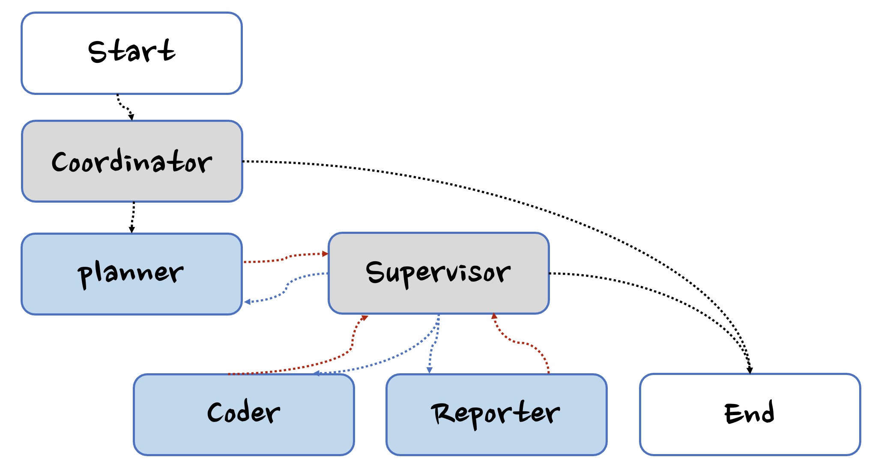

# Bedrock-Manus: AI Automation Framework Based on Amazon Bedrock

<p align="left">
    <a href="https://github.com/aws-samples">
            
    </a>
    <a href="https://github.com/aws-samples/aws-ai-ml-workshop-kr/blob/master/LICENSE">
        
    </a>
</p>

[English](./README.md)

> Amazon Bedrock-Optimized AI Automation Framework

Bedrock-Manus is an AI automation framework optimized for Amazon Bedrock and business use cases.

> Come From Open Source, Back to Open Source

BedrockManus is based on the open-source project [LangManus](https://github.com/Darwin-lfl/langmanus).

## Demo Video

> **Task**: I would like to analyze Amazon product sales data. The target for analysis is the './data/Amazon_Sale_Report.csv' file. Please conduct an analysis to extract marketing insights based on this data. The analysis should start with basic data property exploration, then move on to product sales trends, variable relationships, variable combinations, and various other analytical techniques. If there are any additional analyses needed to extract insights after the initial data analysis, please perform those as well. Please include detailed analysis along with supporting images and charts in the analysis report..

[]

- [View on YouTube](https://youtu.be/DwWICGLEv14)
- Output in Demo is [English- Report.pdf (6 pages)](./assets/report_en.pdf) | [Korean - Report.pdf (12 pages)](./assets/report.pdf)
- Dataset in Demo is [Amazon Sale Report](https://www.kaggle.com/datasets/thedevastator/unlock-profits-with-e-commerce-sales-data)

## Table of Contents
- [Quick Start](#quick-start)
- [Architecture](#architecture)
- [Features](#features)
- [Setup](#setup)
    - [Prerequisites](#prerequisites)
    - [Installation](#installation)
- [Usage](#usage)
- [Contributing](#contributing)
- [Contributors](#contributors)
- [License](#license)
- [Acknowledgments](#acknowledgments)

## Quick Start

```bash
# Clone the repository
git clone https://github.com/aws-samples/aws-ai-ml-workshop-kr.git
cd cd aws-ai-ml-workshop-kr/genai/aws-gen-ai-kr/20_applications/08_bedrock_manus/

# Create and activate virtual environment
cd setup/
./create_conda_virtual_env.sh bedrock-manus

# Run the project
conda activate bedrock-manus
python main.py
```

## Architecture

LangManus implements a hierarchical multi-agent system where a supervisor coordinates specialized agents to accomplish complex tasks:



The system consists of the following agents working together:

1. **Coordinator** - The entry point that handles initial interactions and routes tasks
2. **Planner** - Analyzes tasks and creates execution strategies
3. **Supervisor** - Oversees and manages the execution of other agents
5. **Coder** - Handles code generation and modifications
7. **Reporter** - Generates reports and summaries of the workflow results

## Features

### Core Capabilities
- 🤖 **LLM Integration**
    - Support for all models provided in Amazon Bedrock (Nova, Claude, DeepSeek, Llama, etc.)
    - Multi-tier LLM system for different task complexities

### Development Features
- 🐍 **Python Integration**
    - Built-in Python REPL
    - Code execution environment

### Workflow Management
- 📊 **Visualization and Control**
    - Planning based on TODO list
    - Workflow graph visualization
    - Multi-agent orchestration
    - Task delegation and monitoring

## Setup

### Prerequisites

- This code has been tested in the environments listed below.
    - Amazon SageMaker AI Studio (CodeEditor and JypyterLab)

### Installation

LangManus leverages [uv](https://github.com/astral-sh/uv) as its package manager to streamline dependency management.
Follow the steps below to set up a virtual environment and install the necessary dependencies:

```bash
# Step 1: Create and activate a virtual environment through uv
cd setup/
./create_conda_virtual_env.sh bedrock-manus
```

By completing these steps, you'll ensure your environment is properly configured and ready for development.


## Usage

### Basic Execution

To run BedrockManus with default settings:

```bash
python main.py
```
or use `main.ipynb`

### Advanced Configuration

Bedrock-Manus can be customized through various configuration files in the `src/config` directory:
- `agents.py`: Modify team composition, agent system prompts, and `prompt caching` enablement

### Agent Prompts System

Bedrock-Manus uses a sophisticated prompting system in the `src/prompts` directory to define agent behaviors and responsibilities:

#### Core Agent Roles

- **Supervisor ([`src/prompts/supervisor.md`](src/prompts/supervisor.md))**: Coordinates the team and delegates tasks by analyzing requests and determining which specialist should handle them. Makes decisions about task completion and workflow transitions.

- **Planner ([`src/prompts/planner.md`](src/prompts/file_manager.md))**: Plan and Execute tasks using a team of specialized agents to achieve the desired outcome.

- **Coder ([`src/prompts/coder.md`](src/prompts/coder.md))**: Professional software engineer role focused on Python and bash scripting. Handles:
    - Python code execution and analysis
    - Shell command execution
    - Technical problem-solving and implementation

- **Reporter ([`src/prompts/reporter.md`](src/prompts/coder.md))**: Professional reporter responsible for writing clear, comprehensive reports based ONLY on provided information and verifiable facts.
    - Summary imtermideate results
    - Python code execution (results generation)
    - Shell command execution (results generation)

#### Prompt System Architecture

The prompts system uses a template engine ([`src/prompts/template.py`](src/prompts/template.py)) that:
- Loads role-specific markdown templates
- Handles variable substitution (e.g., current time, team member information)
- Formats system prompts for each agent

Each agent's prompt is defined in a separate markdown file, making it easy to modify behavior and responsibilities without changing the underlying code.

## Contributing

We welcome contributions of all kinds! Whether you're fixing a typo, improving documentation, or adding a new feature, your help is appreciated. Please see our [Contributing Guide](CONTRIBUTING.md) for details on how to get started.

## Citation

- <span style="#FF69B4;"> If you find this repository useful, please consider giving a star ⭐ and citation</span>

## Contributors

- **Dongjin Jang, Ph.D.** (AWS AI/ML Specislist Solutions Architect) | [Mail](mailto:dongjinj@amazon.com) | [Linkedin](https://www.linkedin.com/in/dongjin-jang-kr/) | [Git](https://github.com/dongjin-ml) | [Hugging Face](https://huggingface.co/Dongjin-kr) |

## License

- <span style="#FF69B4;"> This is licensed under the [MIT License](https://github.com/aws-samples/aws-ai-ml-workshop-kr/blob/master/LICENSE). </span>

## Acknowledgments

Special thanks to all the open source projects and contributors (especilly LangMauns) that make BedrockManus possible. We stand on the shoulders of giants.
