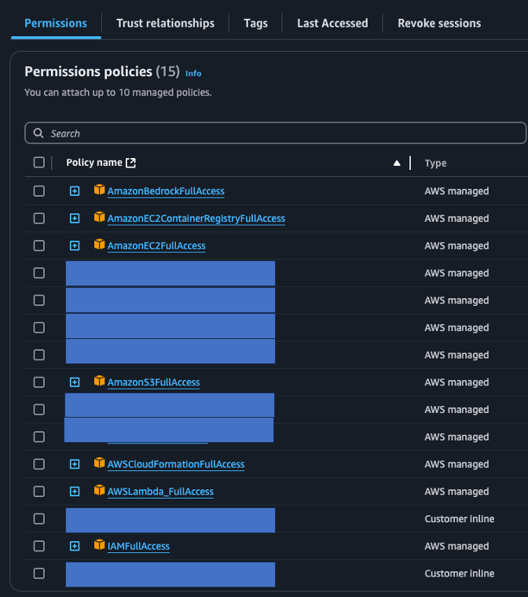
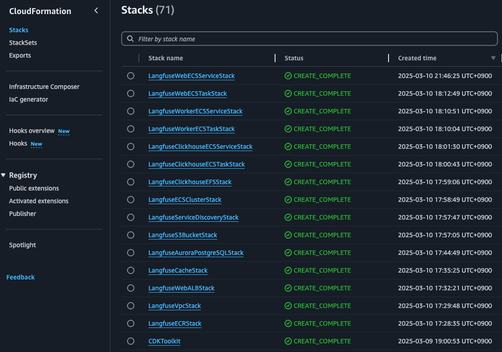
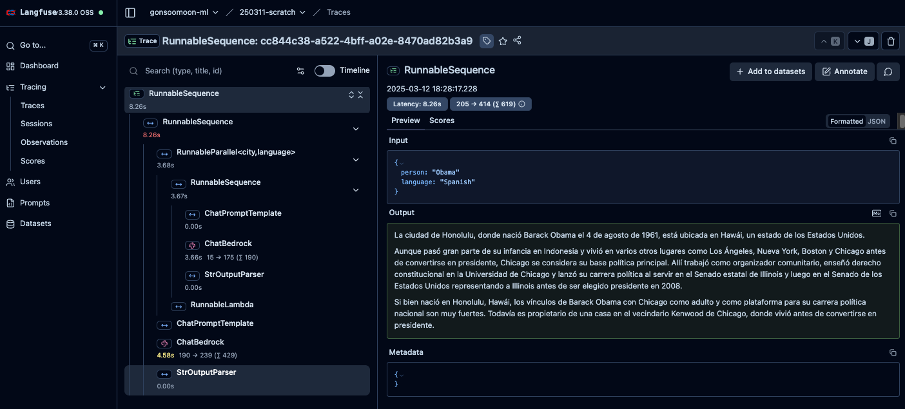

# Langfuse 설치 가이드: Hosting Langfuse V3 on Amazon ECS with Fargate using CDK Python


이 문서의 목적은  Langfuse 를 AWS 인프라에 호스팅을 할때에, [Hosting Langfuse V3 on Amazon ECS with Fargate using CDK Python](https://github.com/aws-samples/deploy-langfuse-on-ecs-with-fargate/tree/main/langfuse-v3) 에 제시된 설치시 주의할 점 및 부가적인 정보를 제공합니다. 
이 문서는 위 깃 리포의 공식 가이드를 보시면서 사용 하세요.

### 1. 설치 Client
공식 가이드에는 Mac 및 Linux 에서 설치 절차를 제공합니다. 여기 문서는 [SageMaker AI Studio Code Editor](https://docs.aws.amazon.com/sagemaker/latest/dg/code-editor.html) 에서 테스트 완료 되었습니다.

### 2. Git repo 다운로드
- 터미널을 열고 아래를 하나의 라인씩 실행 합니다. 에러가 생기면 확인 하세요.
    ```
    $ git clone --depth=1 https://github.com/aws-samples/deploy-langfuse-on-ecs-with-fargate.git
    $ cd deploy-langfuse-on-ecs-with-fargate
    $ git sparse-checkout init --cone
    $ git sparse-checkout set langfuse-v3
    $ cd langfuse-v3

    $ python3 -m venv .venv
    ```

### 3. cdk.context.json 파일 생성
현재 디렉토리에서 cdk.context.json 파일을 생성하고, openssl rand -base64 32 의 명령을 생성하여 붙여넣기를 하며 아래와 같은 내용을 만듧니다.
```
{
  "private_dns_namespace_name": "langfuse.local",
  "db_cluster_name": "langfuse-db",
  "ecr": [
    {
      "repository_name": "langfuse-web",
      "docker_image_name": "langfuse/langfuse",
      "tag": "3"
    },
    {
      "repository_name": "langfuse-worker",
      "docker_image_name": "langfuse/langfuse-worker",
      "tag": "3"
    },
    {
      "repository_name": "clickhouse",
      "docker_image_name": "clickhouse",
      "tag": "24.12.3.47"
    }
  ],
  "ecs_cluster_name": "langfuse",
  "langfuse_worker_desired_count": 1,
  "langfuse_worker_env": {
    "NODE_ENV": "production",
    "SALT": "a58f71a26b8d4101610e09699a0203ec1a1a696876ef5ce1664e525ca7ade9c9", <--  openssl rand -base64 32 결과로 교체 필요
    "ENCRYPTION_KEY": "6ad972bc9214f5fde0cfbedcffe674eed6b2d1c73a33fe83a3c76f7caf42f44e", <--  openssl rand -base64 32 결과로 교체 필요
    "TELEMETRY_ENABLED": "true",
    "LANGFUSE_ENABLE_EXPERIMENTAL_FEATURES": "true"
  },
  "langfuse_web_env": {
    "NODE_ENV": "production",
    "NEXTAUTH_SECRET": "46cffa5b17451b659b4739deed9588abb1d0631a65f1258abb77e2a8113047fe", <--  openssl rand -base64 32 결과로 교체 필요
    "SALT": "c610826bc9ab97a9b83fe0e29cf4ca3402b22189dac036e9d02b4da507baa111", <--  openssl rand -base64 32 결과로 교체 필요
    "ENCRYPTION_KEY": "f309b76fc599b62c53defd67646980def9aff4dfbef94427b26f9e4a6e95fd95", <--  openssl rand -base64 32 결과로 교체 필요
    "HOSTNAME": "0.0.0.0",
    "LANGFUSE_S3_MEDIA_DOWNLOAD_URL_EXPIRY_SECONDS": "604800",
    "TELEMETRY_ENABLED": "true",
    "LANGFUSE_ENABLE_EXPERIMENTAL_FEATURES": "true",
    "LANGFUSE_SDK_CI_SYNC_PROCESSING_ENABLED": "false",
    "LANGFUSE_READ_FROM_POSTGRES_ONLY": "false",
    "LANGFUSE_READ_FROM_CLICKHOUSE_ONLY": "true",
    "LANGFUSE_RETURN_FROM_CLICKHOUSE": "true"
  }
}

```

### 4. cdk bootstrap 명령어 실행
#### 4.1 필요한 패키지 설치
```
sudo apt update
sudo apt install -y nodejs npm

# CDK CLI 설치
npm install -g aws-cdk
```
#### 4.2 권한 확인 
- 아래와 같이 SageMaker AI Studio Code Editor 를 실행하는 IAM Role에 권한이 있어야 합니다.
    - 
#### 4.3 cdk bootstrap 명령어 실행
```
cdk bootstrap
```
#### 4.4 cdk bootstrap 실행 후에 CloudFormation 에서 설치 확인
- 

### 5. cdk deploy
#### 5.1 cdk deploy
- 다음의 명령어를 실행합니다. 성공할 경우에 약 30분이 소요 됩니다.
    - 저의 경우는 생성시 VPC 5개 초과가 되어서, VPC 생성을 못한다고 에러가 발생했습니다. VPC 를 삭제한 후에 성공 했습니다.
    ```
    cdk deploy --require-approval never --all
    ```
#### 5.2 설치 후에 CloudFormation 화면
- 아래와 같은 설치 완료가 보여야 합니다.
    -  

### 6. Langfuse Endpoint URL 얻기
- 위의 스택에서 LangfuseWebECSServiceStack 를 클릭하고, Outputs 탭에 LoadBalancerDNS 의 Value 를 카피해서 사용하시면 됩니다. 
    - 또 다른 방법으로 공식가이드에 제시된 아래의 명령어를 실행 하면 됩니다.
    ```
        aws cloudformation describe-stacks --stack-name LangfuseWebECSServiceStack --region ${CDK_DEFAULT_REGION} | \
    jq -r '.Stacks[0].Outputs | map(select(.OutputKey == "LoadBalancerDNS")) | .[0].OutputValue'
    ```
    - 위의 명령어를 실행 전에 아래의 명령어를 먼저 실행이 필요할 수 있습니다. 
    ```
    export CDK_DEFAULT_REGION=us-east-1 # 저의 경우에 us-east-1 리젼에서 실행 함.
    sudo apt-get install jq
    ```

### 7. Langfuse 로그인 및 Organization 및 프로젝트 생성
- 위에서 얻은 LoadBalancerDNS 를 브라우저에서 오픈 하세요.
- 공식 가이드를 따라 가시고, 로그인 ID, PW 를 입력하여 계정을 생성합니다. (저의 경우는 ID: 저의 이메일 어드레스및 저 만의 비밀번호를 입력했습니다.)
- Organization 을 하나 생성 합니다. (적당한 이름을 넣으세요.예: gonsoomoon-ml)
- 프로젝트 이름을 입력하고 생성하면 public key, secret key, host 가 생성이 되는데요, 모두를 카피 해두세요.
- 로그인하면 아래와 비슷한 화면이 보입니다. (참조: 이 스크린샷은 제가 몇번 실행한 이후에 결과 입니다.)
    - 

### 8. Langfuse 동작 테스트 노트북 실행하기
- 공식 가이드 처럼 examples/racing_for_langchain_bedrock.ipynb 를 열고 실행 하십시오.
- LoadBalancerDNS 에 들어 가셔서, 실제 실행 결과인 Trace 를 확인 하시면 됩니다.
    - 


## 축하합니다. 설치가 완료 되었습니다.
