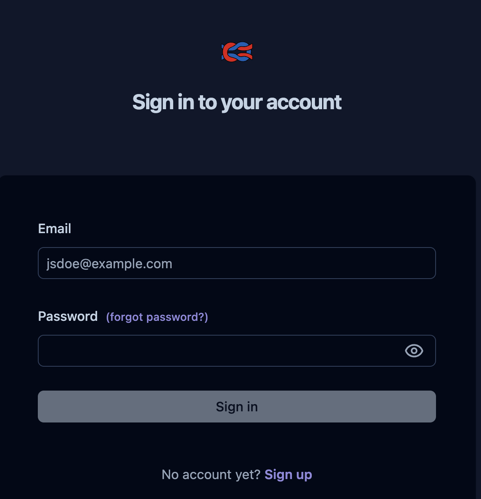
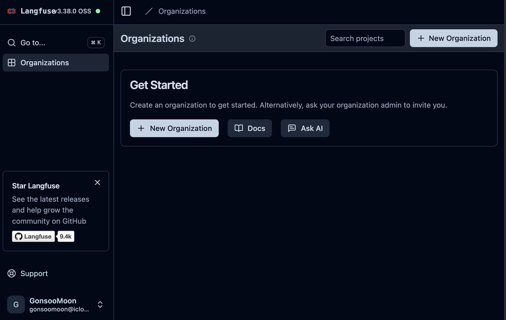
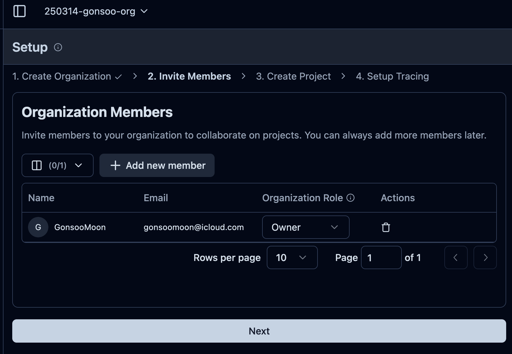

# Langfuse 사용자 가이드: 

이 문서의 목적은  관리자가 Langfuse 를 [LAGNFUSE_ADMIN_README.md](LAGNFUSE_ADMIN_README.md) 의 가이드에 따라서 AWS 인프라에 호스팅을 하고, 유저가 사용을 위한 가이드 입니다. 

## 1. Langfuse Server 접속
- Langfuse Server 가 설치된 Endpoint URL(LoadBalancerDNS) 을 관리자에게 제공 받아서, 브라우저에 접속 합니다. 그러면 아래와 같은 로그인 화면이 나옵니다.
  - 
- "No account yet? Sign up" 에서 Sign Up 링크를 클릭 합니다.
  - 
- Name, Email, Password 를 입력하고, Sign Up 을 누르면 아래와 같은 랜딩 페이지가 나옵니다.
  - 
- Organization name 을 원하는 것으로 입력 하고, Create 를 클릭 합니다.
  -   
- Organization Members 는 일단 Next 로 지나갑니다.
  - 
- API Keys 에서 Secret Key, Public Key, Host 를 복사해서 다른 안전한 곳에 두세요. 나중에 사용할 예정 입니다. 
  - 
- Project name 에 새로운 프로젝트 이름을 입력하고, Create 를 클릭 합니다.
  -    
-   
- 왼쪽 메뉴에서 Tracing --> Traces 를 클릭합니다. 현재는 Trace 가 없기에 이와 같이 나옵니다.
  - 

## 2. 가상 환경 생성
- [가상환결 설치](README.md) 를 클릭해서 가이드에 따라 가상 환경을 설치 합니다.
    - 이미 가상 환경이 설치 되었으면 이 과정은 지나 갑니다.

## 3. 샘플 노트북 실행하기
- 아래의 노트북을 열고, 노트북 커널을 위에서 생성한 "가상 환경(에: Agentic-RAG)" 를 선택 합니다. 이후에 아래의 노트북을 열고 실행 합니다. 노트북의 가이드에 따라서, 19_agentic_rag 폴더 아래에 .env 파일을 만드세요. 이때 API Keys 에서 Secret Key, Public Key, Host 가 필요 합니다. 아래 실행 후에 Endpoint URL(LoadBalancerDNS) 로 접근을 하면, 자동 로그인이 될 겁니다. 만약 그렇지 않다면 위에서 계정 생성한 로그인 정보를 가지고 로그인 합니다. 이후에 왼쪽 메뉴의 Tracing-->Traces 를 보시면 Traces 가 나오고 결과를 확인 할 수 있습니다. 
  - [01-get-started-langfuse-langchain-bedrock.ipynb 실행](../05_start_agentic_workflow_langgraph_bedrock_langfuse/02_langfuse/01-get-started-langfuse-langchain-bedrock.ipynb)

## 축하합니다. 이제 사용 준비가 완료 되었습니다.
