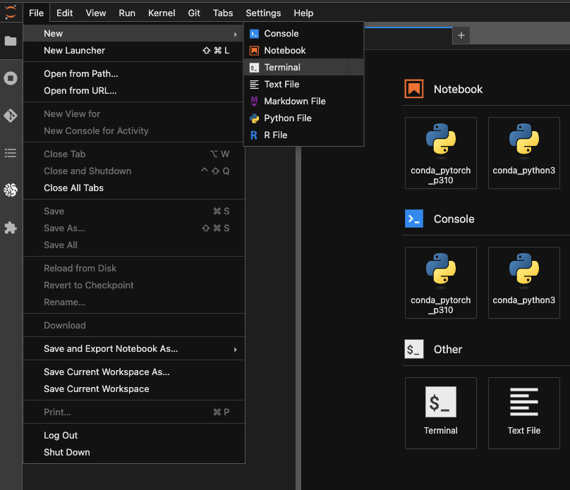
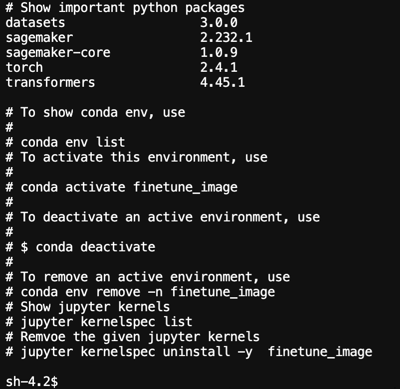
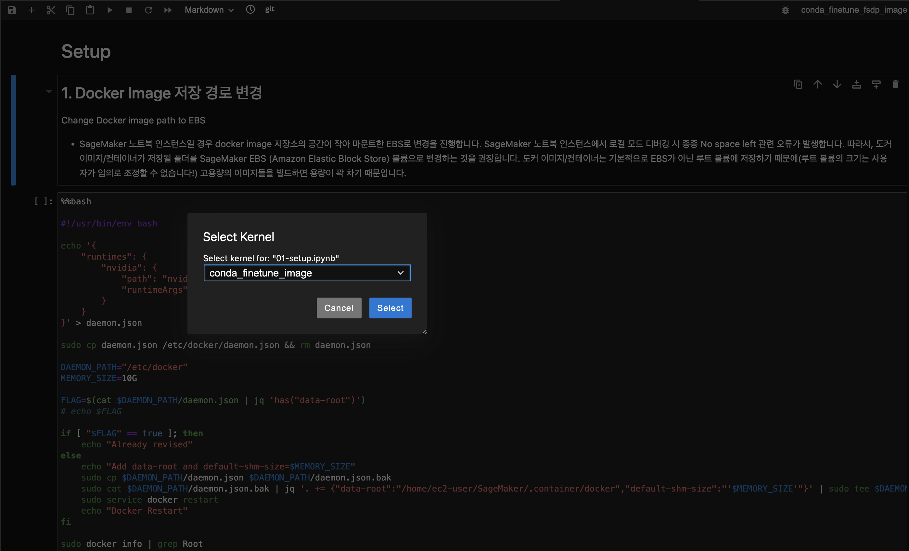

# 설치 가이드

## 1. 실습환경
- 이 노트북은 [SageMaker Notebook Instance](https://docs.aws.amazon.com/sagemaker/latest/dg/nbi.html) 에서 테스트 완료 되었습니다.
    - 환경: ml.g5.4xlarge 및 생성시에 Additional configuration 클릭하고 200 GB EBS 추가 하였습니다. --> 참고: [Create a Notebook Instance](https://docs.aws.amazon.com/sagemaker/latest/dg/howitworks-create-ws.html)

## 2. 실습 환경 세팅
### 2.1. JupyerLab 을 열고 아래와 같이 터미널을 오픈 하세요.
- 
### 2.2. 아래와 같이 명령어를 넣고 Git 리포를 클로닝 합니다.
    ```
    pwd
    cd SageMaker/
    git clone https://github.com/aws-samples/aws-ai-ml-workshop-kr.git
    ```
- 
### 2.3. Conda Virtual Environment 생성 (약 5분 소요)
- 가상 환경을 구성 합니다.
- setup 폴더로 이동을 합니다. 아래의 그림의 왼쪽 처럼, 탐색기로 setup 폴더까지 이동 합니다. 아래의 경로를 따라가 보세요.
    ```
    cd aws-ai-ml-workshop-kr/genai/aws-gen-ai-kr/30_fine_tune/03-fine-tune-llama3/llama3-1/setup
    ```
    - 
- shell 을 아래의 명령어를 넣어서 실행 합니다. 위의 그림을 참조 하세요.
- 가상 환경 이름은 원하는 이름으로 하셔도 좋습니다. 여기서는 lfinetune_image 으로 했습니다.
    ```
    1. [QLoRA] ./create_conda_virtual_env.sh finetune_image
    ```    
- 설치 확인을 합니다. 아래와 같은 화면이 나왔으면 성공입니다. 이렇게 나오지 않았으면 터미널에서 실행 내역에 "에러" 가 있는지 확인 하세요.
    - 

### 2.4. 01-setup.ipynb 노트북 열고 커널 설정
- [01-setup.ipynb](01-setup.ipynb) 을 열고 위에서 만든 콘다 커널을 설정 합니다.
- 이후 모든 노트북에서는 위에서 만든 커널 (예: conda_finetune_fsdp_image) 을 사용합니다.
- 

### 2.5 01-setup.ipynb 노트북 실행
- 도커 이미지가 기본으로 저장되는 경로를 수정하는 스크립트 입니다. 로컬 모드 등의 도커 이미지 다운로드에 사용 됩니다.

## 설치가 완료 되었습니다. 축하 드립니다. !
- [README 로 다시 이동하기](../README.md)


