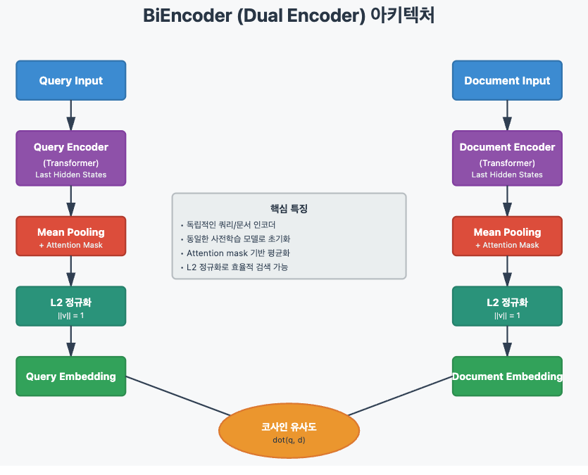
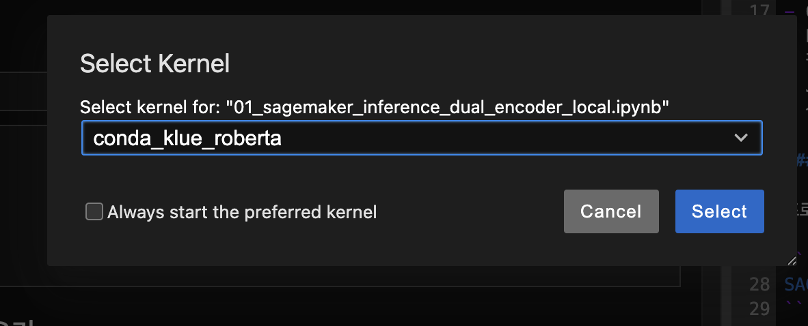

# KLUE RoBERTa SageMaker Inference

Updaed: Sep 29, 2025

## A. SageMaker Inference를 활용한 BiEncoder 모델 서빙
이 워크샵은 KLUE RoBERTa 모델을 BiEncoder 방식으로 SageMaker Endpoint에 배포하고, 쿼리와 문서의 임베딩을 생성하여 의미적 유사도를 계산하는 실습입니다.


- 이 시스템은 AWS SageMaker Inference를 사용하여 BiEncoder 모델을 프로덕션 환경에 배포하고 서빙합니다.
- SageMaker는 확장 가능한 추론 엔드포인트를 제공하여 실시간으로 쿼리와 문서 간의 유사도를 계산할 수 있게 합니다.
- BiEncoder는 쿼리와 문서를 각각 독립적인 인코더로 처리하는 dual encoder 구조입니다. 각 인코더는 Transformer 기반 모델로 입력을 처리한 후, mean pooling으로 고정 크기 벡터를 생성하고 L2 정규화를 통해 크기를 1로 만듭니다. 이렇게 정규화된 벡터들은 단순 내적만으로 코사인 유사도를 계산할 수 있어 검색이 매우 효율적입니다.
- 실제 실행 결과에서
    - '김치찌개' 쿼리와 한국 전통 음식 문서는 0.87의 높은 유사도를,
    - '색깔' 쿼리와 에펠탑 문서는 0.47의 낮은 유사도를 보여 모델이 의미적 관련성을 정확히 포착함을 확인할 수 있습니다. 

```
   Pair-wise similarity scores:

   Pair 1: [0.8666] - 상 (High)
      Query: '맛있는 한국 전통 음식 김치찌개'
      Doc:   '김치찌개와 된장찌개는 한국의 대표 전통 음식입니다....'

   Pair 2: [0.7164] - 중 (Medium)
      Query: '최신 기술 발전'
      Doc:   '인공지능 기술이 빠르게 발전하고 있습니다....'

   Pair 3: [0.4745] - 하 (Low)
      Query: '색깔'
      Doc:   '파리의 에펠탑은 프랑스의 상징입니다....'
```
- Dual Encoder Architecture
    - 

## B. 사전 준비

### 0. 프로젝트 루트 폴더
- aws-ai-ml-workshop-kr/genai/aws-gen-ai-kr/40_inference/08-roberta-sagemaker-inference
### 1. 환경 설정
이 코드는 SageMaker Notebook Instnace 에서 테스트 완료 되었습니다. 
[SageMaker Notebook Instnace](https://docs.aws.amazon.com/ko_kr/sagemaker/latest/dg/nbi.html) 의 사용 방법을 확인 하세요.

프로젝트 setup 디렉토리에서 Conda 기반 설정 스크립트를 실행합니다:

```bash
cd setup
./setup.sh
```

이 스크립트는 다음을 자동으로 수행합니다:
- Conda 환경 생성 (`klue_roberta`)
- Python 3.11 설치
- 필요한 패키지 설치 (PyTorch 2.5.0, SageMaker SDK 등)
- Jupyter 커널 등록
- 설치 검증

### 2. .env 파일 작성

프로젝트 루트에 `.env` 파일을 생성하고 AWS SageMaker Role ARN을 설정합니다:

```bash
SAGEMAKER_ROLE_ARN=arn:aws:iam::YOUR_ACCOUNT_ID:role/YOUR_SAGEMAKER_ROLE
```

**필수 IAM 권한**: Role에는 다음 권한이 필요합니다:

**Attached Managed Policies (권한):**
- `AmazonSageMakerFullAccess` - SageMaker 리소스 생성 및 관리
- `AmazonS3FullAccess` - 모델 아티팩트 저장 및 접근
- `AmazonEC2ContainerRegistryFullAccess` - Docker 이미지 접근
- `IAMFullAccess` - (선택사항) IAM 역할 관리가 필요한 경우

**Trust Relationship (신뢰 관계):**
```json
{
  "Version": "2012-10-17",
  "Statement": [
    {
      "Effect": "Allow",
      "Principal": {
        "Service": "sagemaker.amazonaws.com"
      },
      "Action": "sts:AssumeRole"
    },
    {
      "Effect": "Allow",
      "Principal": {
        "Service": "scheduler.amazonaws.com"
      },
      "Action": "sts:AssumeRole"
    }
  ]
}
```

**참고**:
- `sagemaker.amazonaws.com`: SageMaker 서비스가 이 역할을 사용할 수 있도록 허용
- `scheduler.amazonaws.com`: EventBridge Scheduler가 Scale-to-Zero 기능을 위해 Inference Component를 관리할 수 있도록 허용

## C. 실습 진행
1. **커널 선택**: 노트북에서 "conda_klue_roberta" 커널 선택
- 

### 노트북 실행 순서

`notebook` 폴더에는 세 개의 노트북이 있습니다:

1. **01_sagemaker_inference_dual_encoder_local.ipynb**
   - 로컬 환경에서 SageMaker Local Mode를 사용한 추론
   - 모델 동작 검증 및 빠른 테스트
   - 로컬 Docker를 사용하여 SageMaker 환경 시뮬레이션

2. **02_sagemaker_inference_dual_encoder.ipynb**
   - 실제 SageMaker Endpoint 생성 및 배포
   - S3에 모델 업로드
   - ml.g4dn.xlarge 인스턴스를 사용한 실제 추론

3. **03_sagemaker_inference_dual_encoder_scale_to_zero.ipynb**
   - Inference Component를 사용한 Scale-to-Zero 배포
   - EventBridge Scheduler를 사용한 자동 스케일링 (주말 scale-in, 평일 scale-out)
   - ManagedInstanceScaling으로 MinInstanceCount=0 설정
   - 비용 최적화를 위한 자동화된 인스턴스 관리

**참고**: 01번 노트북을 스킵하고 02번 또는 03번 노트북만 단독으로 실행해도 됩니다.

## D. 주요 기능

- **BiEncoder 방식**: 쿼리와 문서를 독립적으로 인코딩하여 임베딩 생성
- **배치 추론**: 여러 쿼리와 문서를 동시에 처리
- **코사인 유사도 계산**: 쿼리-문서 간 의미적 유사도 측정
- **SageMaker Local Mode**: 로컬에서 빠른 테스트 및 디버깅

## E. 모델 구조

```
model.tar.gz/
├── config.json
├── model.safetensors
├── special_tokens_map.json
├── tokenizer.json
├── tokenizer_config.json
├── vocab.txt
└── code/
    ├── inference.py
    └── requirements.txt
```

## F. 기술 스택

- **모델**: KLUE RoBERTa Base
- **프레임워크**: PyTorch 2.5.0 (CUDA 12.1)
- **배포**: AWS SageMaker
- **Python**: 3.11
- **환경 관리**: Conda

## G. 환경 정보

- **Conda 환경**: `klue_roberta`
- **Jupyter 커널**: "KLUE RoBERTa (Python 3.11)"
- **GPU 지원**: CUDA 12.1

## H. 문제 해결
노트북에서 `!which python`이 잘못된 Python을 가리키는 경우: 해결 필요.
