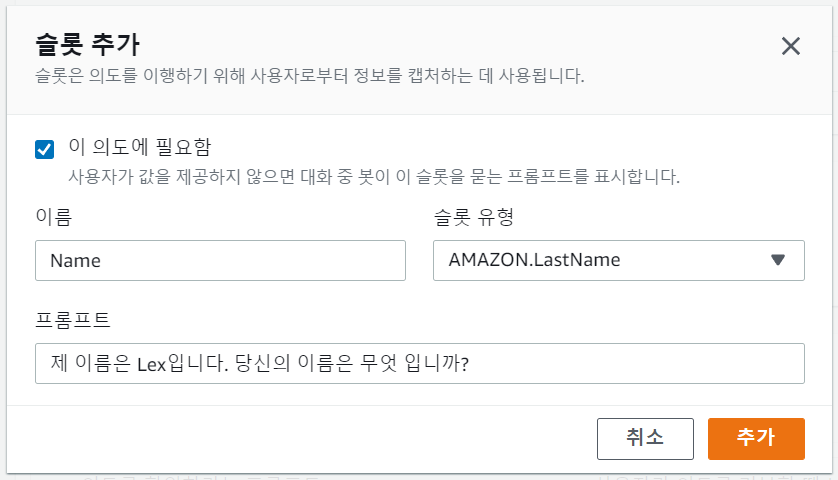
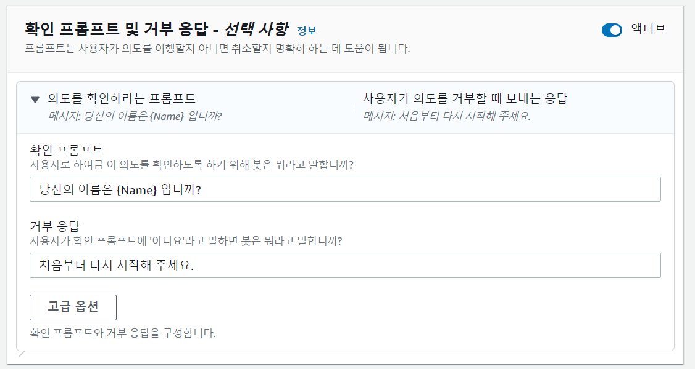
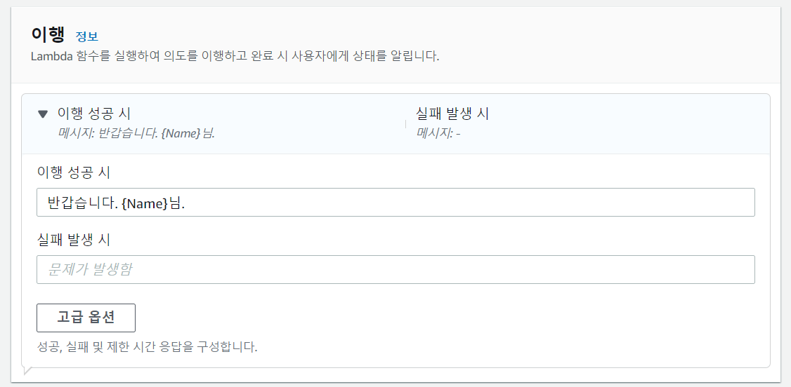
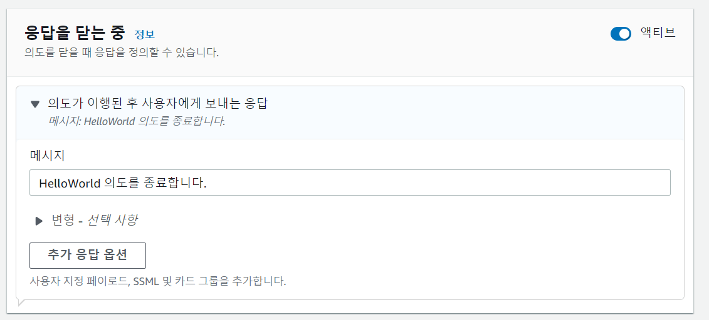
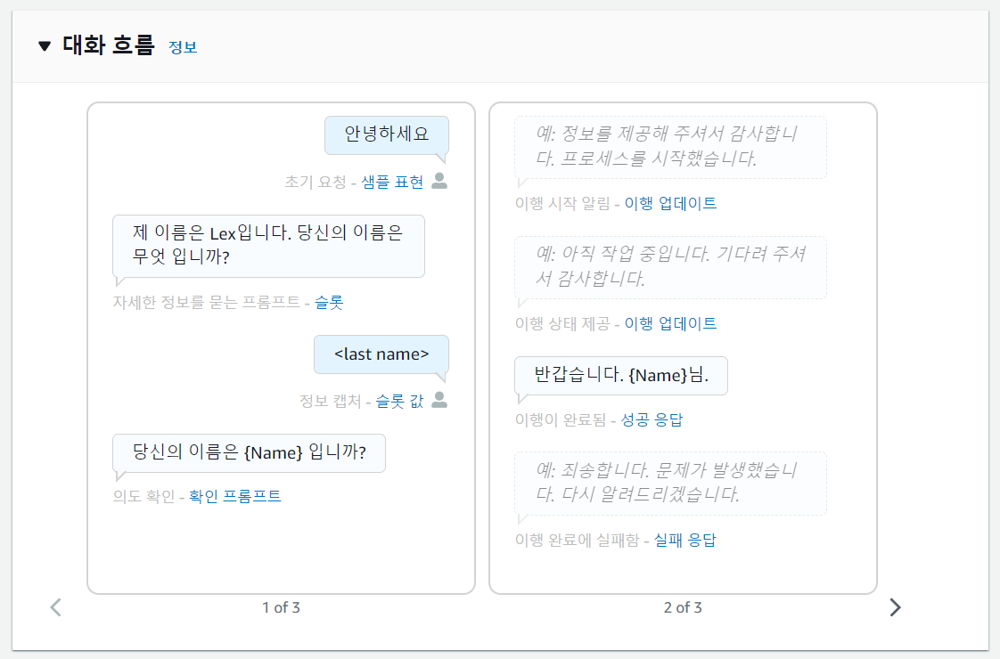
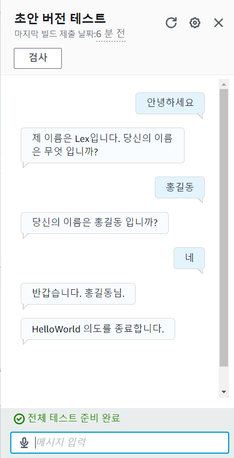
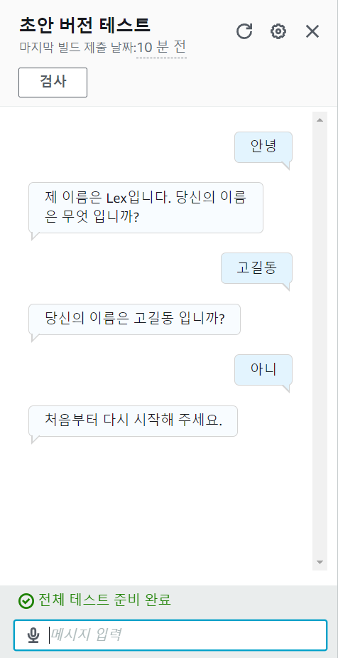

# 1. Hello World 봇 만들기

## 개요

여기서는 챗봇의 구조를 이해하기 위해 단순한 인사를 주고 받는 인사봇을 만들어 보겠습니다. 봇의 이름은 여러 프로그래밍 언어의 첫 예제 이름으로 많이 쓰이는 Hello World에 봇을 붙여서 HelloWorldBot 이라고 하겠습니다.

## Amazon Lex 봇 기본 지식

봇을 만들기 전에 먼저 기본적인 용어및 개념들을 살펴봅시다.

### 봇 관련 용어 설명

1. 의도(Intent) - 사용자가 수행하려는 작업입니다. 이를 통해 봇은 사용자가 수행하려는 작업을 이해하고 분류할 수 있습니다. 단일 봇은 여러 개의 다른 의도를 포함할 수 있으므로 하나의 봇이 사용자의 서로 다르지만 가장 유사한 관련 요청을 처리할 수 있습니다.
1. 표현(Utterance) - 의도를 트리거하기 위해 사용자가 입력하거나 말해야 하는 내용의 텍스트 표현입니다. 하나의 인텐트에는 다양한 발언이 포함될 수 있으므로 사용자가 다양한 구문을 사용하여 봇을 트리거하고 발언과 함께 다양한 데이터 매개변수(또는 "슬롯")를 제공할 수 있습니다.
1. 프롬프트(Prompt) - Lex는 은행 계좌 번호나 항공편 예약 날짜를 요청할 때와 같이 대화의 여러 단계에 대해 다른 프롬프트를 정의할 수 있습니다. 또한 Lambda 함수에 의해 런타임에 재정의될 수 있습니다.
1. 슬롯(Slot) - 봇이 작업을 수행하기 위해 필요한 데이터 항목입니다. 예를 들어 항공편 예약 의도의 경우 출발지 공항, 도착지 공항, 비행 날짜, 비행 시간 및 예약 클래스에 대한 슬롯이 필요할 수 있습니다. Lex에는 많은 내장 슬롯 유형이 있지만 사용 사례에 맞게 사용자 정의 슬롯 유형을 자유롭게 생성할 수 있습니다.
1. 이행(Fulfillment) - 종료 메시지와 사용자에 대한 몇 가지 추가 정보가 있는 봇의 최종 출력 메세지 입니다. 예를 들어 항공편 예약의 경우 이행에는 사용자가 예약한 경로 및 항공편 번호에 대한 간략한 요약과 함께 항공편이 예약되었음을 확인할 수 있는 메시지가 출력됩니다.

### Amazon Lex 봇 구조

모든 Amazon Lex 봇은 다음의 구조를 따릅니다.

모든 봇은 만들때 반드시 한 개 이상의 언어를 선택해야 합니다. 언어를 선택한 후엔 봇에 의도, 표현, 슬롯 등을 설정하는 UI를 볼 수 있습니다.

위 구조에서도 볼 수 있듯이 의도, 표현, 슬롯은 각각의 언어별로 정의해야 합니다. 사용자 지정 슬롯에 사용되는 동의어는 언어마다 다르며 의도별로 필요한 표현의 수와 구조도 마찬가지 입니다.

## 봇 기본 구조 생성

봇이 실제로 무엇을 할 것인가를 정의하기 전에 먼저 기본 구조를 만들어야 합니다.

- 앞서서 만든 관리자 권한 계정으로 AWS 콘솔에 로그인 합니다.
- 화면 상단의 Unified Search 창에 `Lex`를 입력 한 다음 표시되는 서비스 목록에서 **Amazon Lex**를 선택합니다. 리전은 **서울**을 선택해 주시고 언어는 **한국어**를 선택해 주세요.

- **봇 생성** 버튼을 클릭하여 봇 설정 구성 화면으로 이동합니다.

- **빈 봇을 생성합니다**를 선택한 다음 **봇 이름**에 `HelloWorldBot`을 입력 하고,  **설명 - 선택사항**에 `간단한 인사를 수행하는 Hello World 봇 입니다.`를 입력합니다.

- IAM 권한 섹션에서는 런타임 역할에 **기본 Amazon Lex 권한으로 역할을 생성합니다.** 를 선택합니다. 이 옵션은 Amazon Lex가 다른 AWS서비스를 호출 할 수 있도록 하는 권한을 IAM 역할을 통해 제공합니다.

- 이 봇은 COPPA와 관련이 없으므로 COPPA 설정 섹션에서 **아니오**를 선택합니다.

> 참고: 미국내 관련 법에 따라 미국에 기반을 둔 회사가 13세 이하 어린이를 대상으로 한 봇을 제공하고자 하는 경우 콘솔 또는 Amazon Lex API를 사용하여 childDirected필드를 true로 설정하여 봇이 어린이 온라인 개인정보 보호법(COPPA)의 적용을 받는다고 Amazon Lex에 알려야 합니다.

- Amazon Lex는 설정된 시간 동안만 세션을 유지합니다. 사용자가 유휴 상태이고 이 시간 동안 입력을 제공하지 않으면 세션이 종료됩니다. 이 워크숍에서는 기본값인 **5분**을 사용합니다.

- 이 워크숍에서는 태그를 사용하지 않으므로 **고급 설정** 섹션은 그대로 두고 맨 아래에 있는 **다음** 버튼을 눌러 봇 기본 구조 생성을 완료합니다.

## 봇에 언어 추가

봇 생성이 완료되면 자동으로 언어 추가 화면으로 이동합니다. 이 단계에서는 최소 한 개 이상의 언어를 선택 해야만 합니다. 현재 Amazon Lex는 한국어를 포함해 13개 언어를 지원합니다. Amazon Lex는 v2부터 동시에 여러 언어를 사용할 수 있도록 복수의 언어를 음성 상호 작용에 추가하는것이 가능합니다. 이 워크숍에서는 한국어를 사용하겠습니다.

- 언어 선택 - 한국어(KR)을 선택합니다.

- 음성 상호 작용 - 봇이 사용자와 상호 작용하는 데 사용하는 텍스트 투 스피치 음성입니다. 한국어의 경우 polly의 한국어 음성인 서연(Seoyeon)이 선택됩니다.

- 의도 분류 신뢰도 점수 임계값 - Amazon Lex가 반환하는 신뢰도 점수는 0부터 1사이의 숫자로 여러 의도를 비교하기 위한 상대 값 입니다. 이 값은 Amazon Lex가 개선됨에 따라 변경될 수 있습니다. 봇이 대화의 의도를 좀 더 엄격하게 인식하길 원한다면 1에 가까웃 숫자를. 조금 덜 엄격하길 원한다면 0에 가까웃 숫자를 설정합니다. 이 워크숍에서는 기본치인 0.4를 그대로 사용하겠습니다.

이제 봇의 기본 구조가 완성되었습니다. 다음단계에서는 본격적으로 봇을 구현해 보도록 하겠습니다.

---

# 인사 봇 구현

간단한 인사를 주고 받을 수 있는 Hello World 봇을 만들어 보려 합니다.

## 첫 번째 의도 작성하기

앞서 언어 선택이 끝나면 바로 이어서 첫 번째 **의도**를 추가하는 화면으로 이동합니다.
좌측 메뉴에 표시된 의도 목록을 보면 이미 FallbackIntent라는 이름을 가진 기본 제공 의도가 등록되어 있는것을 볼 수 있습니다. 이 FallbackIntent는 사용자의 입력이 등록된 의도와 일치하지 않을 경우 기본으로 표시할 내용을 정의하는데 단순히 등록만 되어 있을뿐 아직 챗봇에서는 사용할 수 없습니다.

## HelloWorld 의도 추가

의도 추가 화면에서 다음과 같이 각각의 섹션을 설정합니다. 섹션에서 지정한 입력란이 보이지 않을 경우 삼각형 버튼을 눌러 확장 합니다.

- **대화 흐름**  
  봇과 사용자 간의 대화가 시각화 되어 표시됩니다. 처음에는 아무것도 설정되어 있지 않기 때문에 아무내용이 없고 의도에 대한 확인 프롬프트 및 종료 응답 등의 다른 대화 상자 노드를 추가하면 대화 흐름이 자동으로 생성됩니다. 우선 아래 섹션들을 설정한 후에 다시 돌아와 확인해 보겠습니다.

- **의도 세부 정보**

  - 의도 이름: HelloWorld

- **샘플 표현**
  이 의도를 호출하기 위해 사용자가 말하거나 입력할 것으로 예상되는 대표적인 구문입니다. Amazon Lex는 샘플과 다를 수 있는 사용자 입력을 해석하기 위해 샘플 표현을 기반으로 추정합니다.

  - 하단의 `안녕하세요`를 입력한 후에 **표현 추가** 버튼을 클릭
  - 같은 위치에 `안녕`을 입력한 후에 **표현 추가** 버튼을 클릭

- **슬롯**  
  봇이 의도를 이행하는 데 필요한 정보입니다. 봇이 아래 우선순위에 따라 의도 이행에 필요한 슬롯을 묻는 프롬프트를 표시합니다. 여기서는 사용자의 이름을 입력 받로록 하겠습니다.
  - **슬롯 추가** 버튼을 클릭한 후에 다음과 같이 설정
    - **이름**: `Name`
    - **슬롯 유형**: 리스트 박스에서 `AMAZON.LastName`을 선택
    - **프롬프트**: `제 이름은 Lex입니다. 당신의 이름은 무엇 입니까?`
  - **추가** 버튼을 클릭

- **확인 프롬프트 및 거부 응답**
  - 확인 프롬프트에 `{Name}님 반갑습니다.`를 입력 합니다.

> {Name}에는 방금 추가한 슬롯의 Name프롬프트에서 입력받은 값이 설정됩니다.

- **이행**
  - 이행 성공 시: `반갑습니다. {Name}님.`
  - 실패 발생시: 이 의도는 Lambda를 통한 처리등을 수행하지 않기 때문에 실패 발생시는 공란으로 둡니다

- **응답을 닫는 중**  
  의도가 종료되는것을 사용자에게 알리는 메시지를 정의 할 수 있습니다.
  - 메시지: `HelloWorld 의도를 종료합니다.`

- 이제 다시 위로 올라가 **대화 흐름**섹션의 삼각형 버튼을 눌러 설계한 의도의 대화 흐름을 검토해 봅시다.

- 여러분의 첫 번째 Lex 챗봇을 만드는 여정이 거의 끝나갑니다. 이 HelloWorldBot에서는 Lambda를 사용하지 않기 때문에 **코드 후크** 섹션은 그대로 둡시다. 이제 **의도 저장** 버튼을 눌러 지금까지 작성한 의도를 저장하고 **구축** 버튼을 눌러 HelloWorldBot을 구축합니다.

- 의도 설정에 문제가 없을 경우 상단 메시지 표시창에 **구축 중**이라는 메시지가 얼마동안 표시되다 **구축 성공**으로 바뀌게 됩니다.

- 이제 **테스트** 버튼을 눌러 봇의 테스트를 진행해 봅시다.

- 프롬프트의 정보를 잘못 입력한 경우에 대한 테스트도 진행해 봅시다.

- 설계된 의도이긴 하지만 반말도 잘 알아 듣는것을 확인할 수 있습니다.

축하합니다! 이것으로 여러분은 첫 Amazon Lex 챗봇을 성공적으로 만들었습니다.
이어서 Lambda를 이용해 좀더 복잡한 처리를 할 수 있는 뱅킹 챗봇을 만들고 AWS CloudFormation를 이용해 자동화된 배포를 수행해 보겠습니다.

## [2. 뱅킹 봇 구축](BankingBot.md)
