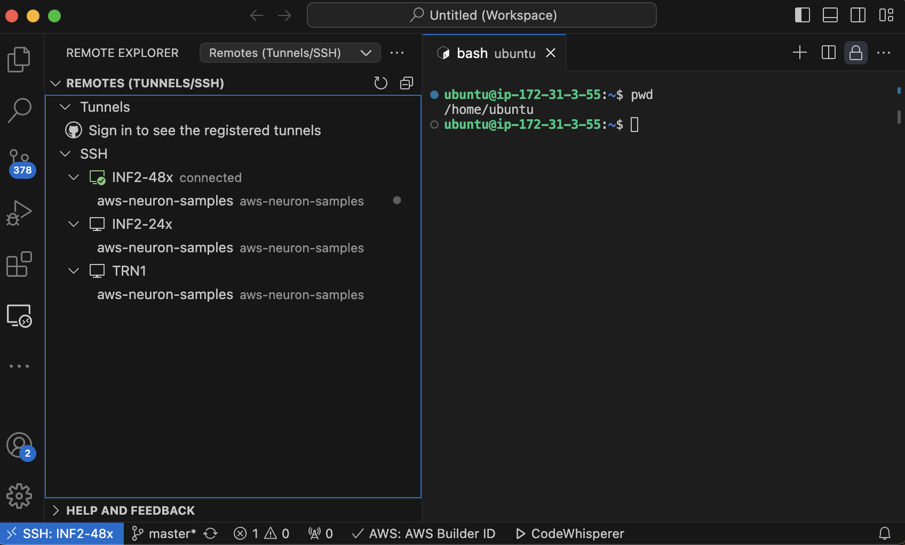
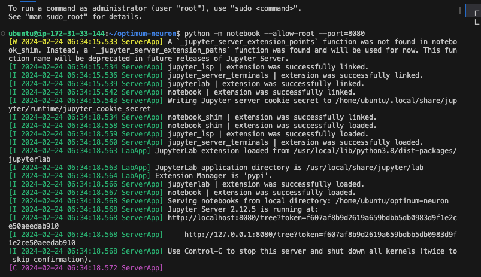
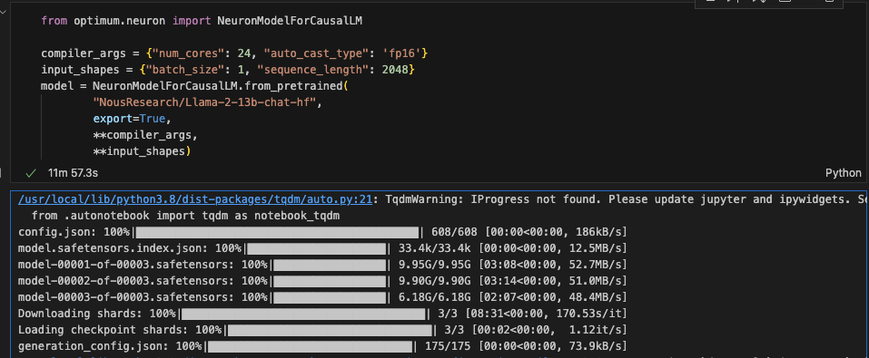
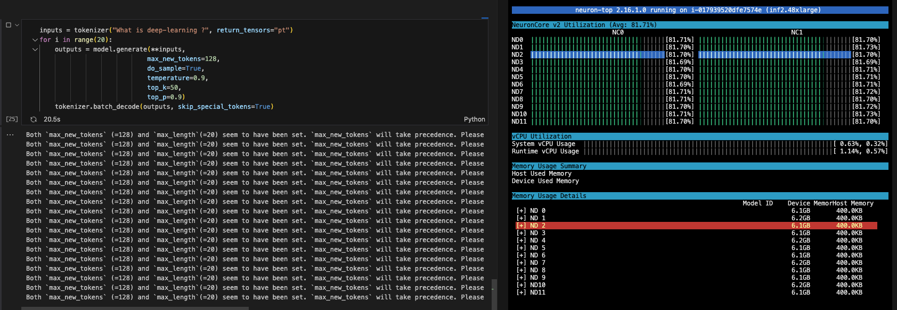

#  AWS Inferentia 기반 위에 llama-2-13B 이용하여 챗봇 데모

Last Update: Feb 24, 2024

---

이 튜토리얼은 inf2.32xlarge 로 Llama-2-13b 모델을 로드하여 추론을 위한 가이드 입니다. 아래의 노트북을 실행 하기 위함 입니다. 
- [Create your own chatbot with llama-2-13B on AWS Inferentia
](https://github.com/huggingface/optimum-neuron/blob/main/notebooks/text-generation/llama2-13b-chatbot.ipynb)

실행을 위해서 위의 해당 노트북을 참조 하시고, 여기서는 중요 가이드 및 일부 코드 실행 결과를 보여 드립니다. 

참조:
- [Create your own chatbot with llama-2-13B on AWS Inferentia](https://huggingface.co/docs/optimum-neuron/tutorials/llama2-13b-chatbot)
<br>
<p> 

# 1. 기본 사전 단계
## Quota 준비 
- 먼저 AWS 계정에 아래에 해당되는 기본적인 [Quota](https://docs.aws.amazon.com/servicequotas/latest/userguide/intro.html) 가 필요 합니다. [inf2.48xlarge](https://awsdocs-neuron.readthedocs-hosted.com/en/latest/general/arch/neuron-hardware/inf2-arch.html) 는 vCPU 가 192개 필요하므로 Running On-Demand Inf Instances 가 192 개 이상 있어야 합니다. 
- 

# 2. 기본 환경 

##  2.1. Launch the Instance (inf2.48xlarge EC2 생성)
- Region: us-east-1, Subnet: us-east-1c, AZ: use1-az6 에서 진행 했음.
- AMI, Instance Type 지정. 
    - 
- [중요] <u>Storage 는 200 GB 로 수정해주세요.</u>
- Trouble Shooting: Error
    - inf2.48xlarge EC2 런칭시에 아래와 같은 에러:
        - Failed to start the instance i-04c1XXXXXXXX The requested configuration is currently not supported. Please check the documentation for supported configurations.
    - 솔루션
        - 위의 이유는 해당 Region 및 Availability Zone (AZ) 에 해당 EC2 가 부족하여 발생하는 에러 입니다. EC2 생성시에 Network 부분의 Subnet 을 바꾸어서 해보세요. 그래도 에러가 발생하면 AWS Account 팀에 문의 바랍니다. 

## 2.2 EC2 Connection
- 편하신 방법으로 EC2 에 SSH 로 연결하시면 됩니다. 저는 로컬에서 VS Code Remote Connection 으로 연결 하였습니다. 
- 

## 2.3 Start Jupyter Server and Select Kernel
- (1) 아래와 같이 VS Code 에서 Jupyter 를 설치 합니다.
    - 
- (2) 아래와 같이 jupyter server 실행 합니다.
    ```
    python -m notebook --allow-root --port=8080
    ```
    - 
- (3) 아래의 화면 오른쪽 하단의 llama-2-13b-chat-neuron 노트북을 오픈합니다. 이후에 노트북 오른쪽 상단에 "Select Kernel" 읈 선택하고, Jupter Server 에서 제공한 경로(예: ```http://127.0.0.1:8080/tree?token=f607af8b9d2619a659bdbb5db0983d9f1e2ce50aeedab910```) 를 복사해서 --> "Existing Jupyter Server --> Enter Url of Jupter Serve --> 여기서 붙이기를 합니다. 이후에 아래와 같은 화면이 나옵니다.
    - 

<p>

# 3. 노트북 실행
## 3.1. NeuronModelForCausalLM 통한 모델 컴파일 및 로딩
- 아래와 같이 Huggingface format 의 모델을 컴파일 하여 NEFF(Neuron Executable File Format) 파일로 변환 후에 모델 로딩 합니다.이 시점에 24개의 Neuron 을 사용하여 로딩 합니다.
    - 
- 아래는 모델 추론을 20개를 해보고 있고, Neuron 24개 모두 사용되고 있고, 각각이 약 80% 정도 사용을 하고 있습니다. 또한 Neuron Accelerator (2개의 neuron 있음) 는 32 GB GPU 메모리에서 약 6.1 GB 사용됨을 보여 주고 있습니다. 
- 

    

여기까지 오셨으면 성공 하셨습니다. 축하 드립니다. ^^

---
Contributor: 문곤수 (Gonsoo Moon)