# AWS Glue DataBrew and SageMaker Canvas Hands on Lab

---

## 1. AWS Glue DataBrew를 이용한 데이터 전처리

### 1-1. Dataset
본 실습에서는 UCI Bike sharing dataset (https://archive.ics.uci.edu/ml/datasets/bike+sharing+dataset) 을 사용하며 컬럼정보는 다음과 같습니다.
> - instant: record index
> - dteday : date
> - season : season (1:springer, 2:summer, 3:fall, 4:winter)
> - yr : year (0: 2011, 1:2012)
> - mnth : month ( 1 to 12)
> - hr : hour (0 to 23)
> - holiday : weather day is holiday or not (extracted from http://dchr.dc.gov/page/holiday-schedule)
> - weekday : day of the week
> - workingday : if day is neither weekend nor holiday is 1, otherwise is 0.
> + weathersit :  
> 	1: Clear, Few clouds, Partly cloudy, Partly cloudy  
> 	2: Mist + Cloudy, Mist + Broken clouds, Mist + Few clouds, Mist  
> 	3: Light Snow, Light Rain + Thunderstorm + Scattered clouds, Light Rain + Scattered clouds  
> 	4: Heavy Rain + Ice Pallets + Thunderstorm + Mist, Snow + Fog   
> - temp : Normalized temperature in Celsius. The values are divided to 41 (max)  
> - atemp: Normalized feeling temperature in Celsius. The values are divided to 50 (max)  
> - hum: Normalized humidity. The values are divided to 100 (max)  
> - windspeed: Normalized wind speed. The values are divided to 67 (max)  
> - casual: count of casual users
> - registered: count of registered users
> - cnt: count of total rental bikes including both casual and registered

  
### 1-2. AWS Glue DataBrew 환경준비
1. UCI 사이트에 접속하고 [데이터셋](https://archive.ics.uci.edu/ml/machine-learning-databases/00275/Bike-Sharing-Dataset.zip)을 다운로드 받아 로컬 PC에 저장하고 압축을 해제합니다.
1. 고유한 이름의 S3 버킷을 생성하고 다운받은 파일 중 `hour.csv`파일을 업로드합니다.
    - [S3 콘솔](https://console.aws.amazon.com/s3)로 이동한 후 Create bucket 버튼을 클릭하고 버킷을 생성합니다.
    - 버킷명 샘플 : `databrew-lab-<<your unique id>>`
    - 생성된 버킷을 클릭하고 Upload 버튼을 클릭한 후 드래그 & 드랩으로 파일을 업로드합니다.
1. AWS Glue Databrew 데이터셋을 생성합니다.
    - [AWS Glue DataBrew 콘솔](https://console.aws.amazon.com/databrew/)로 이동합니다.
    - 왼쪽 메뉴에서 DATASETS 선택 후 Create new dataset 버튼을 클릭합니다.
    - Amazon S3를 선택하고 이전 단계에서 생성한 버킷을 선택하고 그 아래 단계에서 `hour.csv`파일을 선택합니다.
    -  
    - 나머지는 디폴트값을 사용하여 Create dataset 버튼을 클릭합니다.
1. AWS Glue Databrew 프로젝트를 생성합니다.
    - 왼쪽 메뉴에서 PROJECTS 선택 후 Create Project 버튼을 클릭합니다.
    - 다음 내용을 참고하여 프로젝트 상세 내용을 입력하고 
        - Project name : `bike-sharing-prediction-project`
        - Select a dataset : `hour`
    - Permissions 섹션에서 `Create new IAM role` 을 선택합니다.
    - 
    - `New IAM role suffix`항목의 임의의 이름(에:`default-role`)을 기재하고 Create Project 버튼을 클릭합니다.
1. 프로젝트 환경이 준비되는 동안 Dataset 메뉴로 이동하여 Data profiling job을 실행합니다.
    - 데이터셋 메뉴에서 `hour` 데이터셋을 선택하고 Run data profile 버튼을 클릭합니다.
    -  
    - 디폴트값 상태에서 다음 세 항목을 변경한 후 Create and run job 버튼을 클릭합니다.
        - Job run sample 섹션에서 Full dataset을 선택합니다.
        - 
        - Joub output settings의 S3 location 항목에서 첫단계에서 생성한 S3 버킷을 선택합니다.
        - 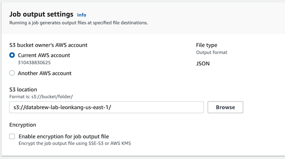
        - Permissions 섹션에서 앞서 생성한 Role을 선택합니다.
1. 프로젝트 메뉴로 이동하여 다음 내용을 확인합니다. 
    - AWS Glue DataBrew 프로젝트 환경이 생성이 완료되면 프로젝트명을 클릭하여 작업환경으로 이동합니다. 
    - 
    - 컬럼별 데이터의 분포와 컬럼별 샘플데이터를 확인합니다.
    - 왼쪽 상단 프로젝트명 아래의 Sample 링크를 클릭하면 Sampling 사이즈를 조절할 수 있습니다.
    - 
1. Data profiling job이 완료되면 다음 내용을 확인합니다.
    - DATASETS 메뉴에서 `hour`파일명을 클릭하고 Data profile overview 탭으로 이동합니다.
    - Profiling 작업의 내용을 확인합니다.
    - 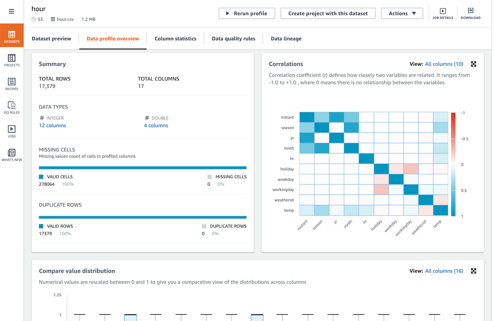


### 1-3. AWS Glue DataBrew 데이터 변환 Recipe 작성
1. AWS Glue DataBrew Project 작업환경으로 이동합니다.
1. 메뉴바에서 Column > Delete를 선택하고 casual, registered 컬럼을 삭제합니다.
    - 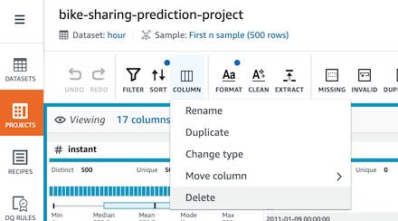
    - 오른쪽 세부설정에서 casual, registered 컬럼을 선택하고 Preview Changes 링크를 클릭합니다.
    - 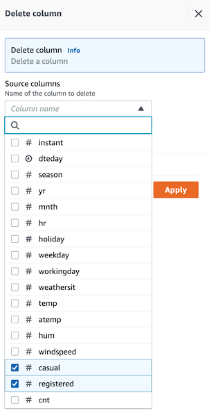
    - Preview 내용을 확인한 후 Apply 버튼을 클릭합니다.
    - 
    - Apply 버튼을 클릭하면 Preview에서 확인한 내용이 반영됩니다. (아래 두 컬럼 삭제 후 결과화면 참조)
    - 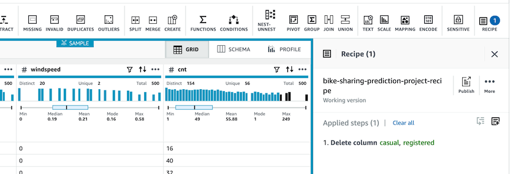
1. `datetime` 컬럼을 생성합니다. (이후 SageMaker Canvas에서 시계열 데이터 예측모델 생성시 요구되는 포맷으로 생성합니다.)
    - 현재 데이터셋에 년(year), 일(day) 컬럼이 별도로 없으므로 `dteday`컬럼으로부터 추출하여 새 컬럼을 생성합니다.
    - 
    - year, day 항목을 각각 추출하여 두개의 컬럼을 추가합니다.(Destination column을 각각 `year`, `day`로 설정하여 두번 실행합니다.)
    - 
    - `year`, `day`컬럼이 각각 추가되었습니다. 
    - 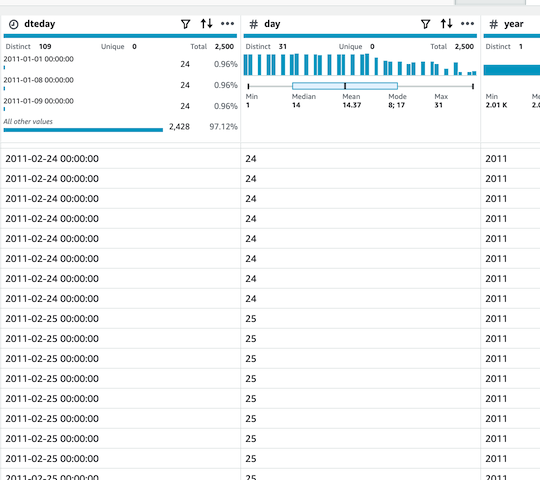
    - FUNCTIONS 메뉴에서 Date functions > DATETIME 을 선택합니다.
    - 
    - 년, 월, 일, 시 정보를 소스컬럼으로부터 가져오도록 선택하고, 분, 초 는 0으로 입력합니다.
    - 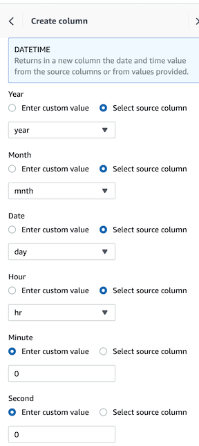
    - 컬럼명을 `datetime`으로 입력하고 Preview > Apply 를 클릭하여 반영합니다.
    - 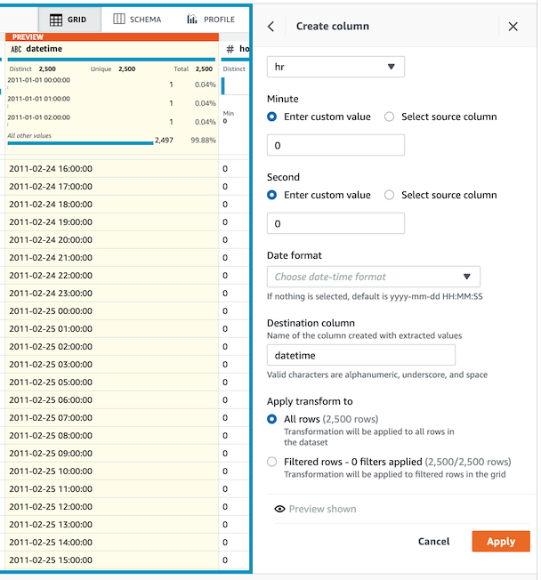
1. (옵션) 이후 작업에서 새로운 `datetime`컬럼을 사용할 것입니다. 기존 컬럼 또는 작업에 사용된 컬럼을 삭제합니다.
    - COLUMN > Delete 기능을 이용하여 `dteday`, `day`, `year`, `mnth`, `hr` 컬럼을 삭제합니다.
    - 
1. `storeid` 컬럼을 추가합니다. (이후 SageMaker Canvas에서 시계열 데이터 예측모델 생성시 예측단위로 활용됩니다.)
    - FUNCTIONS 메뉴에서 Text functions > CHAR 를 선택합니다.
    - 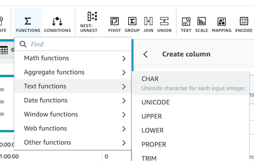
    - Value using을 Custom value로 선택하고 49 를 입력합니다. (유니코드 49의 값은 '1'입니다.)
    - 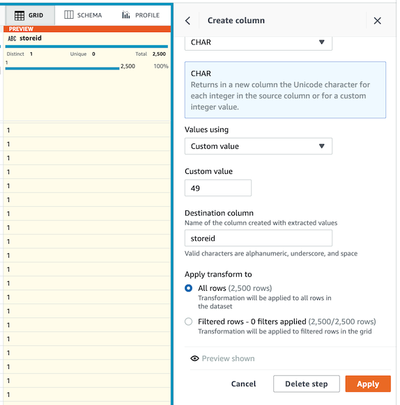
1. (옵션) `season` 컬럼에 대하여 one-hot encoding을 실행합니다. (본 실습에서는 기능 확인을 위해 진행합니다. SageMaker Canvas 사용시 one-hot encoding이 자동으로 적용되므로 실제 작업에서는 본 단계가 필요하지 않습니다.)
    - 메뉴에서 ENCODE > One-hot encode column을 선택합니다.
    - source 컬럼으로 `season`을 선택합니다.
    - Apply transform to 항목에 `All rows`를 선택합니다.
    - Preview Changes 를 클릭하고 변경사항을 확인 후 Apply 버튼을 클릭합니다.
  
   
### 1-4. AWS Glue DataBrew 데이터 변환 작업 실행
1. 변환작업을 실행할 배치작업을 생성합니다.
    - 작업환경 오른쪽의 Recipe를 확인합니다.(환경이 보이지 않을 경우 우상단의 Recipe 버튼을 클릭하면 토클됩니다.)
    - 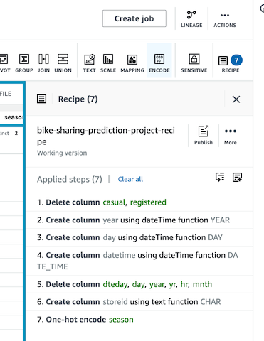
    - 오른쪽 위의 `Create Job`버튼을 클릭하고 아래 내용을 입력한 후 Create job 버튼을 클릭합니다.
        - Job name : `bike-sharing-transform-job`
        - 
        - S3 location : 초기 단계에서 생성한 버킷 선택
        - 
        - Permissions : 초기 단계에서 생성했던 Role 선택
        - 
    - Create job을 누른후 JOBS 메뉴로 이동하면 작업이 생성된 것을 확인할 수 있습니다. 생성된 작업을 체크하고 Run job을 클릭합니다.
    - 
    - 작업이 Running 상태인 것을 확인합니다. 작업은 1~3분 정도 소요됩니다.  
    - 
1. (옵션) 작업이 진행되는 동안 AWS Glue의 Scheduling 기능을 확인합니다.
    - JOBS > Schedules 탭으로부터 Create schedule 버튼을 클릭합니다.
    - 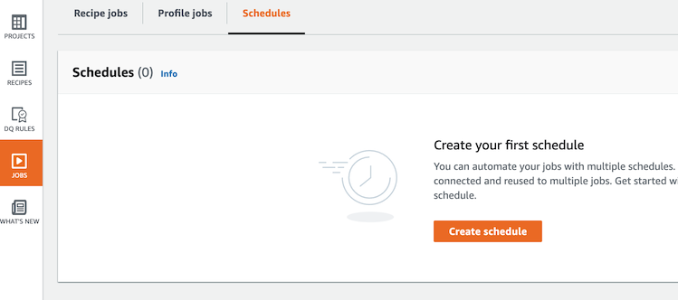
    - 임의의 값을 입력한 후 Add 버튼을 클릭합니다.
    - 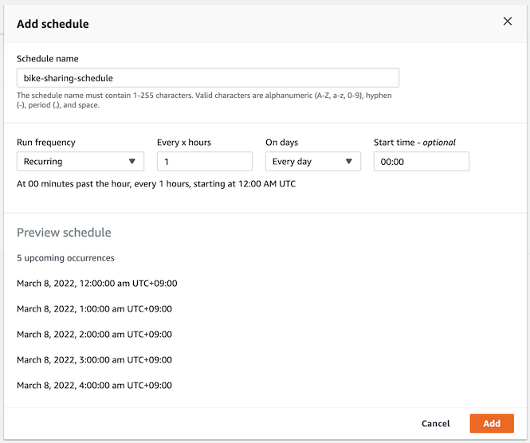
    - Recipe jobs 탭으로 이동 후 실행중인 (또는 완료된) Recipe job 을 체크한 후 Action의 Edit를 선택합니다.
    - Associate schedule 섹션에서 방금 생성한 스케줄을 연결할 수 있는 것을 확인합니다.
    - 
    

---

### 2. Amazon SageMaker Canvas를 이용한 예측모델 개발

### 2-1. Amazon Sagemaker Canvas 데이터셋 준비

1. [SageMaker 콘솔](https://console.aws.amazon.com/sagemaker/)로 이동하고 SageMaker Canvas를 실행합니다. (최초 실행시 수분 정도가 소요됩니다.)
    - 
1. Datasets 메뉴에서 Import 버튼을 클릭합니다.
    - 
1. Glue DataBrew S3 버킷에 작업명으로 폴더가 생성되었을 것입니다. 해당 폴더의 결과파일을 선택하고 Import data 버튼을 클릭합니다.
    - 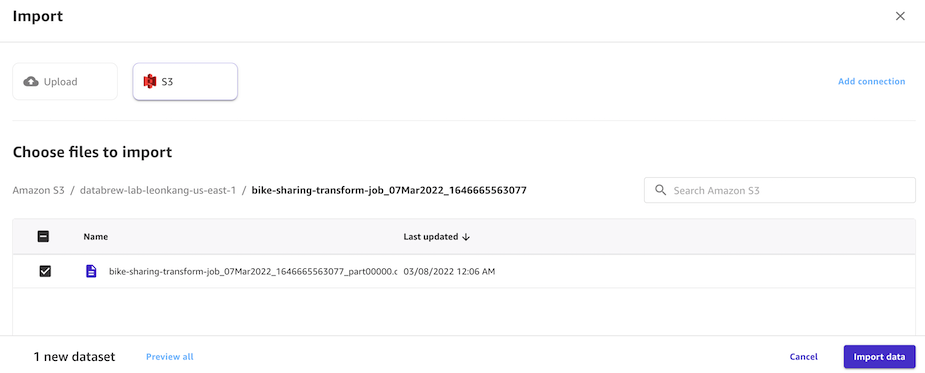
1. Preview 등을 통해 Import된 파일을 확인합니다.


### 2-2. Regression 예측모델 실행
1. Models 메뉴에서 +New model 버튼을 클릭합니다.
1. Model name으로 `bike-sharing-regression` 을 입력하고 Create 버튼을 클릭합니다.
    - 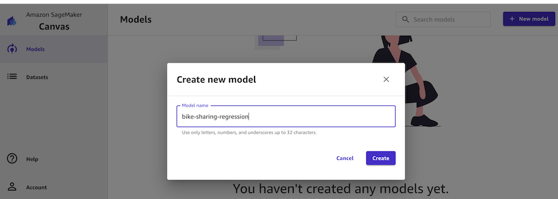
1. 데이터셋을 선택하고 Select dataset 버튼을 클릭합니다.
1. Build 단계에서 내용을 아래와 같이 변경합니다. 
    - Select a column to predict 에서 Target column을 `cnt`로 선택합니다.
    - Model type에서 Chage type을 누르고 팝업에서 Numeric prediction을 선택합니다.
    - 데이터셋 컬럼에서 다음 컬럼을 선택합니다. 
        - `workingday`, `windspeed`, `weekday`, `weathersit`, `temp`, `season`, `hum`, `holiday`, `atemp` 선택 (곧, `storeid`, `season_1`, ..., `season_4`, `instant`, `datetime` 을 선택 해제합니다.)
        - 
    - Quick Build 버튼을 클릭합니다. (작업은 5~10분 정도 소요됩니다.)
1. 모델 빌드 결과를 확인하고 예측을 실행합니다.
    - Analyze 결과가 도출되면 모델의 성능 매트릭과 함께 컬럼별 중요도를 확인할 수 있습니다. 본 샘플에서 자전거 대여에 가장 큰 영향을 미치는 요인은 습도와 온도인 것으로 분석되었습니다.
    - 
    - Predict 버튼을 클릭하고 학습에 사용한 데이터셋을 선택하고 Generate predictions 버튼을 클릭합니다. (본 예제에서는 편의를 위해 동일파일을 사용하지만 학습과 예측에 동일한 데이터를 사용하는 것은 반드시 피해야 할 안티패턴입니다.)
    - 잠시 후 추론 작업이 완료되면 예측결과를 확인하고 다운받을 수 있습니다.
    - 
    
### 2-3. Timeseries 예측모델 실행
1. 다음은 동일 파일을 사용하여 Timeseries 에측모델을 생성합니다. Timesereis 예측실행을 위해서 IAM 권한 수정이 필요합니다.
    - [SageMaker 콘솔](https://console.aws.amazon.com/sagemaker)로 이동한 후 SageMaker Domain > Studio 메뉴에서 Execution role 이름을 확인하고 기억합니다.(또는 복사합니다.)
    - 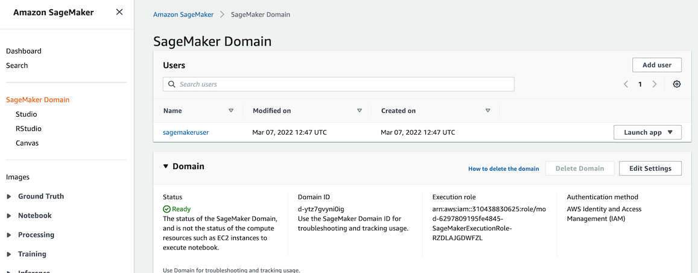
    - [IAM 콘솔](https://console.aws.amazon.com/iamv2)로 이동한 후 Roles 메뉴에서 이전 단계에서 조회한 Role을 찾습니다. (대부분의 경우 `SageMakerExecutrionRole`.. 을 포함하는 이름입니다.)
    - 
    - IAM Role의 Permissions 탭에서 Add permissions 버튼을 클릭하고 Attach policies를 선택합니다.
    - Other permissions policies 항목에서 AmazonForecastFullAccess를 검색하여 추가합니다. (체크박스 선택 후 Attach policies 버튼을 클릭합니다.)
    - 동일한 IAM Role에서 Trust relationships 탭으로 이동한 후 Edit trush policy 버튼을 클릭합니다.
    - 편집창이 오픈되면 다음내용을 붙여넣습니다. 
    ```
    {
        "Version": "2012-10-17",
        "Statement": [
          {
            "Effect": "Allow",
            "Principal": {
              "Service": [
                  "sagemaker.amazonaws.com",
                  "forecast.amazonaws.com"
              ]
            },
            "Action": "sts:AssumeRole"
          }
        ]
    }
    ```
    - 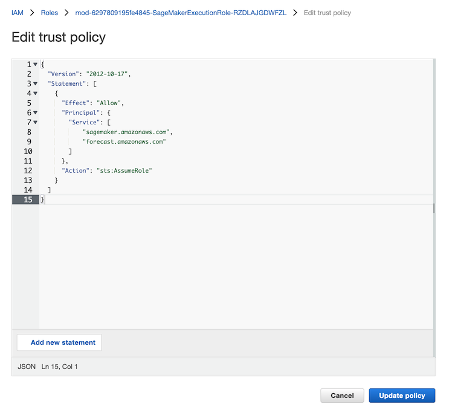
1. SageMaker Canvas 화면으로 돌아와서 Models 메뉴에서 +New model 버튼을 클릭합니다. 
1. 모델명을 `bike-sharing-timeseries`로 입력하고 Create 버튼을 클릭합니다.
1. 데이터셋을 선택하고 Select dataset 버튼을 클릭합니다.
1. Build 단계에서 내용을 아래와 같이 변경합니다. 
    - Select a column to predict 에서 Target column을 `cnt`로 선택합니다.
    - Model type에서 Chage type을 누르고 팝업에서 Time series forecasting을 선택합니다.
    - Model type에서 Config를 누크로 팝업에서 다음과 같이 설정합니다.
        - Item ID column : `storeid`
        - Group column : blank
        - Select a time stamp colum : 
        - Hours (미래 예측구간) : 48
    - 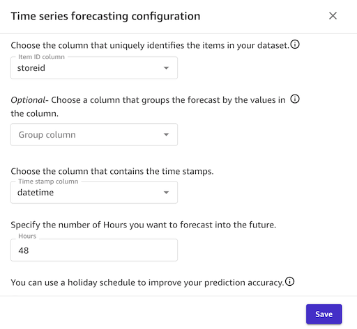
    - 데이터셋 컬럼에서 다음 컬럼을 선택합니다. 
        - `workingday`, `storeid`, `holiday`, `datetime` 선택 
        - 
    - Standard Build 버튼을 클릭합니다. (작업은 2~5시간 정도 소요됩니다.)
1. 모델 빌드 결과를 확인하고 예측을 실행합니다.
    - 빌드가 완료되면 WAPE (Weighted Average Percentage Error)로 매트릭이 표시됩니다.
    - 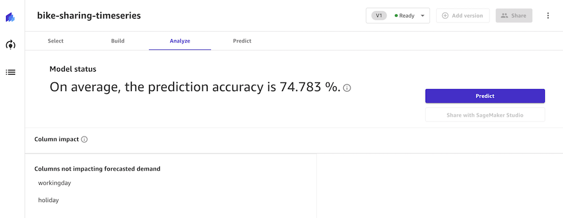
    - Predict 탭으로 이동하여 Start predict를 클릭하면 배치 예측결과를 생성할 수 있습니다.
    - 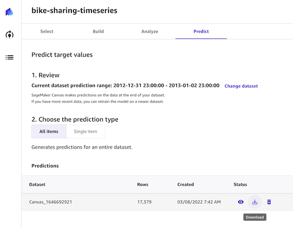
    - 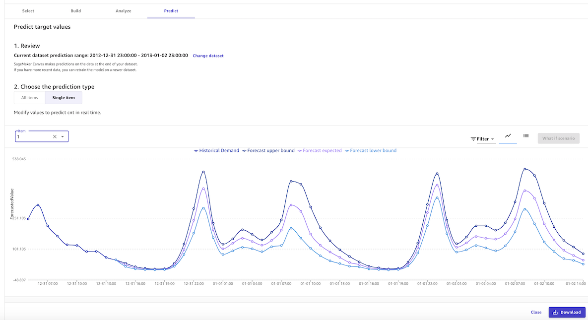

  
수고하셨습니다.  
Amazon SageMaker Canvas와 AWS Glue DataBrew에 대한 추가 실습이 필요하신 경우 아래 실습가이드를 함께 참고하십시오.
- SageMaker Canvas 실습 워크샵 : https://catalog.us-east-1.prod.workshops.aws/workshops/80ba0ea5-7cf9-4b8c-9d3f-1cd988b6c071/en-US/
- AWS Glue DataBrew 실습 워크샵 : https://catalog.us-east-1.prod.workshops.aws/workshops/44c91c21-a6a4-4b56-bd95-56bd443aa449/en-US/lab-guide/transform-glue-databrew

실습에 참여해주셔서 감사합니다.  