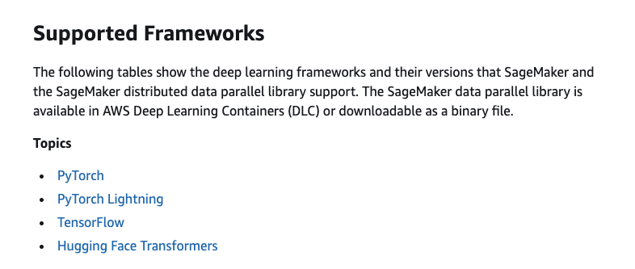

# 2022 AWS Seoul MLOps 및 분산학습 워크샵 실습 가이드
- 날짜
    - 2022.11.08 ~ 11.09 (화, 수)
- 참조 : 메인 이벤트 페이지
    - [MLOps 및 분산학습 워크샵](https://mlops-distributed-training-korea-2022.splashthat.com/)
    
# 1. 실습 환경 구성
- 이벤트 엔진 환경 구성 가이드 링크
    - TBD

## 1.1. Day1 ML Ops
- ML Ops 실습 해시 코드
    - TBD
- SageMaker Studio 기본 생성 사용

## 1.2. Day2 분산 학습
- 분산 학습 실습 해시 코드
    - TBD
- SageMaker Notebook ml.m4.xlagre 으로 생성

# 2. Day1: ML Ops 실습 상세
## 2.1. Day1 ML Ops 실습 링크 및 내용
- TBD


# 3. Day2: 분산 학습 실습 상세
## 3.1. Day2 분산 학습 실습 링크 및 내용
- Git Repo:
    - Distributed Training Workshop on Amazon SageMaker
- URL: 
    - https://github.com/aws-samples/sagemaker-distributed-training-workshop
- 실습 내용
    - 

## 3.2. Lab01 : Amazon SageMaker 이용한 데이터 병렬화(Data Parallelism) 실습
### 3.2.1. 개발자 가이드 및 참조 자료
- 분산 학습 개발자 가이드
    - [Amazon SageMaker Distributed Training Libraries](https://docs.aws.amazon.com/sagemaker/latest/dg/distributed-training.html)
    - 
- SageMaker Distributed Data Parallel (SM DDP)
    - [Supported Frameworks, AWS Regions, and Instances Types](https://docs.aws.amazon.com/sagemaker/latest/dg/distributed-data-parallel-support.html)
    - 

### 3.2.2. Lab01 코드 개요 (Lab_1.ipynb)
#### (1) pytorch-lightning 설치를 위해서 requirements.txt 생성
```python
%%writefile scripts/requirements.txt
pytorch-lightning == 1.6.3
lightning-bolts == 0.5.0
```
#### (2) 모델 훈련 코드 준비 (mnist.py)
```python
# 파이토치 라이트닝 “환경” 준비
from pytorch_lightning.plugins.environments.lightning_environment import LightningEnvironment
env = LightningEnvironment()
env.world_size = lambda: int(os.environ.get("WORLD_SIZE", 0))
env.global_rank = lambda: int(os.environ.get("RANK", 0))

# 파이토치 라이트닝 Trainer 에 strategy=ddp 와 함께 생성.
import pytorch_lightning as pl
trainer = pl.Trainer(max_epochs=args.epochs, strategy=ddp, devices=num_gpus, num_nodes=num_nodes, default_root_dir = args.model_dir)

# 파이토치 라이트닝 Trainer 에 MNIST 모델 및 데이타 제공하여 훈련
trainer.fit(model, datamodule=dm)
```

#### (3) AWS Deep Learning Container (DLC)  준비
```python
image_uri = '763104351884.dkr.ecr.{}.amazonaws.com/pytorch-training:1.12.0-gpu-py38-cu113-ubuntu20.04-sagemaker'.format(region)
```
#### (4) SageMaker Estimator 생성
```python
estimator = PyTorch(
  entry_point="mnist.py",
  base_job_name="lightning-ddp-mnist",
  image_uri = image_uri,
  role=role,
  source_dir="scripts",
  # configures the SageMaker training resource, you can increase as you need
  instance_count=1,
  instance_type=instance_type,
  py_version="py38",
  sagemaker_session=sagemaker_session,
  distribution={"pytorchddp":{"enabled": True}},
  debugger_hook_config=False,
  # profiler_config=profiler_config,
  hyperparameters={"batch_size":32, "epochs": epoch},
  # enable warm pools for 20 minutes
  keep_alive_period_in_seconds = 20 *60
)
```

#### (5) SageMaker Estimator 의 fit() 함수 실행
```python
# Passing True will halt your kernel, passing False will not. Both create a training job.
estimator.fit(wait=False)
```

#### (6) 모델 학습 Job 생성 및 훈련 실행


#### (7) 멀티 노드 분산 훈련 (예: ml.g4dn.12xlarge 2대 사용)
- estimator 에 instance_count 의 실행할 노드 수만 제공

```python
estimator = PyTorch(
  ## instance_count = 2 로 설정시 2개의 노드 (예: ml.g4dn.12xlarge 2대)
  instance_count=2,
)
```
- 모델 훈련 Job 의 실행 로그를 보면 2개의 노드가 훈련을 실행 함.


#### (8) S3에 모델 아티펙트 (가중치 파일) 생성
- 위치: 
    - SageMaker Console -> 왼쪽 메뉴의 Training -> Training Jobs -> 해당 Training Jobs 클릭 -> 아래쪽에 Output 섹션 확인  


### 3.2.3. Demo Video on YouTube
[](https://www.youtube.com/watch?v=0VWENkgPuYg "PyTorch DDP on SageMaker Distributed Data Parallel")


